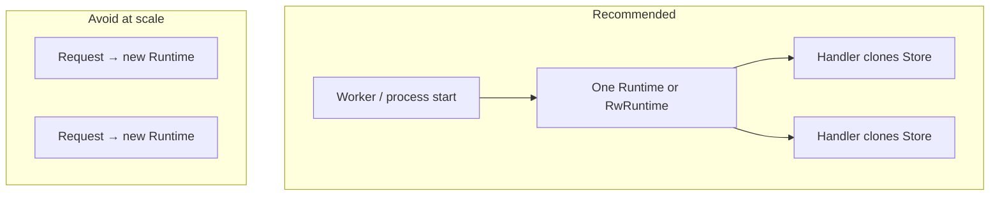

# rust-elm book

| Document | Description |
|----------|-------------|
| [architecture.md](./architecture.md) | Runtime, threading, effects, composition, actors comparison, safe reducer strategy |
| [cmd.md](./cmd.md) | Commands (`Cmd`): reducer boundary, batch vs single, composition, init, cookbook |
| [sub.md](./sub.md) | Subscriptions (`Sub`): long-lived listeners, state-driven sync, tick/stream/WebSocket |
| [effects.md](./effects.md) | Effect system deep dive: architecture, every combinator, parallel/sequential/race recipes |
| [../examples/recursion.rs](../examples/recursion.rs) | Effect recursion — paginated fetch via action → effect → action loop |
| [../examples/sync_recursion.rs](../examples/sync_recursion.rs) | Sync effect recursion — `ExhaustiveTestStore` + `boot`/`receive` (no runtime) |
| [../examples/backoff_retry.rs](../examples/backoff_retry.rs) | `Effect::retry` vs `Effect::retry_backoff` on flaky fetch |
| [store.md](./store.md) | Store dispatch, scoping, legacy snapshot subscription (`subscribe_state`) |
| [api_worker.md](./api_worker.md) | **Server pattern** — one runtime per worker, clone `RwStore` per request |
| [binding.md](./binding.md) | Zero-copy bindings, keypath projection, field change signals (`subscribe_changes`) |
| [safe_reducer.md](./safe_reducer.md) | `safe_reduce_update`, `safe_reduce_rollback`, `CatchReducer` |
| [ecommerce.md](./ecommerce.md) | Shop example: scoping, subs, locks, safe reducer demo, cross-thread store |
| [rw_ecommerce.md](./rw_ecommerce.md) | Same shop on `RwRuntime`: one `RwStore`, `read_store()` on demand |
| [swap_ecommerce.md](./swap_ecommerce.md) | Same shop on `SwapRuntime` (`arc-swap`): lock-free snapshot reads |
| [tea_ecommerce.md](./tea_ecommerce.md) | Same shop on `TeaRuntime`: channel-pushed model (true TEA) |
| [pain.md](./pain.md) | ISO 20022 PAIN.001 payload state + keypath field validation |
| [validation.md](./validation.md) | Reusable keypath validation framework (`Rule`, `Validator`, `Validate`) |
| [../examples/ecommerce.rs](../examples/ecommerce.rs) | Full compositional shop example (4-level actions, scopes, ifLet, forEach) |
| [../examples/rw_ecommerce.rs](../examples/rw_ecommerce.rs) | Shop on `RwRuntime` — single `RwStore`, concurrent readers via `read_store()` |
| [../examples/swap_ecommerce.rs](../examples/swap_ecommerce.rs) | Shop on `SwapRuntime` — lock-free `snapshot_store()` (`arc-swap` feature) |
| [../examples/tea_ecommerce.rs](../examples/tea_ecommerce.rs) | Shop on `TeaRuntime` — channel-pushed model snapshots (true TEA) |
| [../examples/counter.rs](../examples/counter.rs) | Minimal `HashMap<String, u64>` counters on `TeaStore` |
| [../examples/init_cost.rs](../examples/init_cost.rs) | Runtime boot cost — Mutex / Rw / Tea store init with & without full runtime |
| [../examples/api_worker.rs](../examples/api_worker.rs) | One `RwRuntime` per worker; handlers clone `Arc<RwStore>` per request |
| [../examples/read_correctness.rs](../examples/read_correctness.rs) | RwStore parallel read template — `output_state`, replay golden, 100 threads |
| [../examples/rw_counter.rs](../examples/rw_counter.rs) | Same counters on `RwStore` — zero-clone reads via `read_binding` |
| [../examples/swap_counter.rs](../examples/swap_counter.rs) | Compare Tea / Rw / Swap on same counter domain |
| [counter.md](./counter.md) | Counter examples — clone behavior per backend |
| [../examples/safe_reducer.rs](../examples/safe_reducer.rs) | Safe reducer updates: default vs rollback |
| [../README.0.1.0.md](../README.0.1.0.md) | Install and quick start |

---

## Throughput estimates

Numbers below are from **release** builds on Apple Silicon (M-series), reducer = `HashMap<u64,u64>::insert` + `Cmd::none()`, no subscriptions, no effects. Reproduce with:

```bash
cargo run -p rust-elm --example init_cost --release
cargo run -p rust-elm --example throughput --release
cargo bench -p rust-elm --bench hashmap_dispatch -- --noplot
cargo bench -p rust-elm --bench counter -- --noplot
cargo bench -p rust-elm --bench rw_calculator -- --noplot
```

| Workload | Estimated TPS | Notes |
|----------|----------------:|-------|
| Raw `HashMap::insert` (in-process loop) | **~30M** | Upper bound — no bus, no mutex, no notify |
| `Store::dispatch` → reduce → insert (1 thread) | **~2.2M** | End-to-end UDF path; ~460 ns/action |
| 50 threads × 1k = **50k burst** (bus ≥ 16k) | **~1.8M** | Same ceiling — reducer is single-threaded |
| 50k burst (bus = 4k) | **~460k** | Producers block on full bus (`send_blocking`) |

**Key takeaway:** parallel dispatch does **not** multiply reduce throughput. Many threads enqueue actions; **one reducer thread** applies them. Extra threads add queue depth and producer blocking, not more inserts/sec.

The insert itself is ~50 ns; the remaining ~410 ns per action is bus send/recv, `parking_lot` lock, listener notify, and `StoreTask` bookkeeping.

---

## Runtime init cost — can you boot a store per API request?

Release build on Apple Silicon (M-series), `Cmd::none()` init, no subscriptions. Reproduce:

```bash
cargo run -p rust-elm --example init_cost --release
```

### Without runtime (state / reducer only)

| Step | Median time | What it includes |
|------|------------:|------------------|
| **`program init()` only** | **~400 ns** | Default state + empty `Cmd` — no threads, no Tokio, no bus |

This is cheap enough to call on every request **if** you only need a fresh value in memory and will run `update` yourself (unit-test style). It is **not** a live store — no async effects, no concurrent readers, no subscription sync.

### Full runtime bootstrap (thread + Tokio + bus + reducer loop)

Each backend pays roughly the same fixed costs: spawn **Tokio** pool, spawn **reducer thread**, allocate **bus**, run `init` effects, sync subscriptions.

| Backend | Lean config¹ | Default config² |
|---------|-------------:|----------------:|
| **Mutex `Store`** (`Runtime`) | **~165 µs** boot+shutdown | **~370 µs** boot+shutdown |
| **`RwStore`** (`RwRuntime`) | **~170 µs** boot+shutdown | **~360 µs** boot+shutdown |
| **`TeaStore`** (`TeaRuntime`) | **~130 µs** boot+shutdown | **~315 µs** boot+shutdown |

¹ `RuntimeConfig { bus_capacity: 256, worker_threads: 1 }` — good for one API worker.  
² `RuntimeConfig::default()` — bus 4096, Tokio workers = logical CPU count.

| Step | Median time | Notes |
|------|------------:|-------|
| Boot only (no `shutdown`) | **~35 µs** | Thread + Tokio live until drop — leaks resources if forgotten |
| **`Store` handle `clone()`** | **~40 ns** | Shared `Arc` backend — use this per task |
| **`dispatch` enqueue** | **~600 ns** | Fire-and-forget; reduce still ~460 ns end-to-end on hot path |

**Store type does not dominate init cost** — Mutex vs RwLock vs Tea channel differs by only ~10–20%. Almost all time is **Tokio + OS thread + channels**.

### Per-request runtime init — viable?

| Traffic | Cost if you boot+shutdown every request (lean ~165 µs) | Verdict |
|---------|--------------------------------------------------------|---------|
| 100 req/s | ~16 ms/s CPU (~1.6% of one core) | Wasteful but might “work” for prototypes |
| 1 000 req/s | ~165 ms/s (~16% core) | **Avoid** — use shared runtime |
| 10 000 req/s | ~1.6 s/s (>1 core) | **Impossible** to scale |

**Answer:** Do **not** create a full `Runtime` / `RwRuntime` per HTTP request. Reuse **one runtime per process or per worker thread**.

### Recommended design patterns



| Pattern | When | How |
|---------|------|-----|
| **One runtime per worker** | HTTP (Actix, Axum, hyper) | `Runtime::from_program` in worker `main`; `web::Data<Store>` or thread-local clone |
| **One runtime per app** | Desktop / mobile shell | Same as today’s iced/druid examples; drop on exit |
| **Session in state** | Per-user isolation | `HashMap<SessionId, SessionState>` + `Action::ForSession(id, …)` or `ForEachReducer` |
| **Scoped child** | Per-tenant / per-checkout | `RwStore::scope` + `IfLetReducer`; dismiss clears + `Effect::cancel` |
| **Fresh state without runtime** | Pure validation / replay tests | `init()` + synchronous `update` — no `Runtime` |
| **Per-request reset** | Short-lived “transaction” UI | Dispatch `Action::Reset` / `IfLet` dismiss — same runtime, new child state |

**RwStore vs Mutex Store for APIs:** Prefer **`RwRuntime`** when handlers **read** state on thread pool threads (`read_store().with_read`, Copy fields). Use **`Runtime`** when readers are rare or you use `binding()`. **`TeaRuntime`** when you want channel-pushed snapshots to UI subscribers, not for typical REST read paths.

**What to init per request:** the **HTTP context** (path, auth, body) — not the Elm runtime. Pass context into actions; keep one reducer loop owning canonical state.

See [`examples/init_cost.rs`](../examples/init_cost.rs) and [`examples/api_worker.rs`](../examples/api_worker.rs) (runnable worker pattern).

---

## RwStore calculator — 100-thread benchmark

Release build on Apple Silicon (M-series). Domain: [`examples/calc_common.rs`](../examples/calc_common.rs) on [`RwRuntime`](../examples/iced_calculator_rw.rs). Reproduce:

```bash
cargo bench -p rust-elm --bench rw_calculator -- --noplot
```

| Workload | Result | Notes |
|----------|--------|-------|
| **`output_state` correctness** (100 writers × 50 `Digit(1)`) | **PASS** | Copy fields + display match local replay; display = `"1"` × 5000 |
| **`output_state` read** (100 threads, Copy-only) | **~168 ns/read** (~5.9M reads/s) | `read_store().with_read` — no `CalcState` / `String` clone |
| **Parallel dispatch** (100 threads × 5000 actions/bench iter) | **~1.2M actions/s** (~4 ms/iter) | Single reducer thread; bus capacity 65_536 |

### What `output_state` checks

The bench exposes a **Copy-only** snapshot for hot parallel reads:

```rust
struct CalcOutput {
    lhs: Option<f64>,      // Copy
    op: Option<CalcOp>,    // Copy
    fresh_rhs: bool,       // Copy
    display_len: usize,    // Copy
}
```

- **No clone** on the read path — only `Copy` fields are returned from `with_read`.
- **Display correctness** compares `&str` inside the read guard (`output_display_matches`) — no owned `String` until the test builds the replay golden value.
- **Parallel writers:** 100 threads each dispatch `Digit(1)` after `Clear`. Order varies, but the result is commutative (all append `1`), so the final display length and replay still agree.
- Each benchmark iteration **asserts** `output_state` Copy fields and display match the replayed golden state after the queue drains.

See [`benches/rw_calculator.rs`](../benches/rw_calculator.rs).

---

## RwStore counter — 100-thread benchmark

Release build on Apple Silicon (M-series). Domain: [`examples/counter/common.rs`](../examples/counter/common.rs) (`CounterState { a, b, c }` buckets) on [`RwRuntime`](../examples/rw_counter.rs). Reproduce:

```bash
cargo bench -p rust-elm --bench counter -- --noplot
```

| Workload | Result | Notes |
|----------|--------|-------|
| **`output_state` correctness** (100 writers × 50 `B(Inc page_views)`) | **PASS** | Copy totals match replay; `page_views` = 5000; `requests` / `errors` unchanged |
| **`output_state` read** (100 threads, Copy-only) | **~180 ns/read** (~5.6M reads/s) | Reads `requests`, `page_views`, `errors` as `u64` — no `CounterState` clone |
| **Parallel dispatch** (100 threads × 5000 actions/bench iter) | **~700K actions/s** (~7 ms/iter) | `HashMap` bucket `Inc` on reducer thread; bus 65_536 |

### What `output_state` checks

```rust
struct CounterOutput {
    requests: u64,    // bucket `a` — Copy
    page_views: u64,  // bucket `b` — Copy
    errors: u64,      // bucket `c` — Copy
}
```

- **Mutation:** only `CounterAction::B(Inc("page_views"))` from 100 threads; final `page_views` must equal dispatch count.
- **Isolation:** `requests` and `errors` stay at init value (`0`) — other buckets not corrupted.
- **Replay:** recorded actions replayed locally; `output_state` from `read_store()` must match golden totals.
- **No clone** on the read path — all fields are `Copy` `u64`s read under one `with_read` guard.

See [`benches/counter.rs`](../benches/counter.rs) and [`examples/read_correctness.rs`](../examples/read_correctness.rs) (runnable template).

---

## 50k parallel requests — recommended config

Use this when many threads (HTTP handlers, workers, UI surfaces) each call `store.dispatch` and the reducer mostly updates a `HashMap`.

### Runtime / program

```rust
fn init() -> (State, Cmd<Action>) {
    (
        State {
            map: HashMap::with_capacity(50_000), // pre-size for burst
            ..Default::default()
        },
        Cmd::none(),
    )
}

// Bus capacity: third argument — hold the burst without blocking producers.
let runtime = Runtime::from_program(program, Environment::new(), 65_536);
// or: Runtime::from_reducer_program(program, env, 65_536)
```

| Knob | Recommended | Why |
|------|-------------|-----|
| **`bus_capacity`** | **65_536** (min **16_384** for 50k) | `Store::dispatch` uses `send_blocking`; a small bus (e.g. 64–4096) forces producers to wait while the reducer drains. Size ≥ expected burst so all 50k enqueues complete quickly. |
| **Reducer** | `Cmd::none()` for hot path | Effects run on Tokio after reduce; avoid spawning work per insert. |
| **Subscriptions** | `Sub::none()` or narrow gates | Sub sync runs after every reduce; disable during ingest bursts. |
| **State shape** | Flat `HashMap` in root or scoped child | Deep trees + `ForEachReducer` add ns–µs per action; benchmarks in `benches/scope_dispatch.rs`. |
| **Preallocate** | `HashMap::with_capacity(N)` in `init` | Avoids rehash during burst. |

### Store usage

| API | When |
|-----|------|
| `store.dispatch(action)` | Fire-and-forget from worker threads (`store.clone()`) |
| `runtime.dispatch(action)` | Same bus, slightly less overhead (no `StoreTask` queue) — wrap `Runtime` in `Arc` if workers need it |
| `runtime.sender().send_blocking(action)` | Lowest-level enqueue; use when you own the sender |
| `store.send(action).finish()` | Wait for effects — **avoid** on hot path (extra channel + in-flight counter) |
| `store.state()` | **Avoid** during burst — clones entire state |
| `store.binding()` | Zero-copy read/write under lock — prefer over `state()` |
| `store.subscribe_changes()` | UI / readers — field-level signals, no full-state clone |
| `store.subscribe_state()` | Legacy — coalesced `Arc<S>` snapshots (clones `S`) |

Clone `Store` onto each worker thread (`store.clone()` is cheap — shared `Arc` backend).

### Effects and Tokio

- Default Tokio (`rt-multi-thread`) is fine; the reducer thread is separate from worker threads.
- Batch side effects: return one `Effect::task` per N inserts from the reducer, or use a dedicated “flush” action, instead of `Cmd::single` per row.
- For parallel I/O (HTTP, DB), use `Effect::Batch` — effects run concurrently; **actions** still serialize on the reducer thread.

### Bus backpressure

`BusSender::send` (non-blocking) drops when full and increments `bus.dropped_count()`. Production ingress should use `send_blocking` (what `Store` uses) or retry on `send` — monitor `runtime.bus.dropped_count()` if you switch to try-send.

### When 50k parallel is the wrong model

| Need | rust-elm approach |
|------|-------------------|
| 50k **concurrent reduces** | Not supported — one reducer thread by design |
| 50k **ingest** with serial consistency | **Good fit** — ~25–30 ms to drain 50k at ~1.8M TPS |
| 50k **independent entities** | Shard: one `Runtime` per partition, or actors / raw async |
| Sub-millisecond p99 per action under load | Queue latency grows with burst size — bound with rate limiting upstream |

### Checklist for a 50k burst

1. `bus_capacity` ≥ 65_536  
2. `HashMap::with_capacity(50_000)` in initial state  
3. Reducer returns `Cmd::none()` on insert  
4. No subscriptions during ingest (or state-gated subs)  
5. Workers use `store.dispatch`, not `send().finish()`  
6. No `state()` polls until drain completes  
7. Run release: `cargo run --example throughput --release` on your hardware to validate

---

## Related benchmarks

| File | Measures |
|------|----------|
| [`benches/hashmap_dispatch.rs`](../benches/hashmap_dispatch.rs) | Raw insert vs single-thread `dispatch` |
| [`benches/scope_dispatch.rs`](../benches/scope_dispatch.rs) | Scoped / forEach reducer overhead (~2–10 ns) |
| [`examples/throughput.rs`](../examples/throughput.rs) | Printable TPS for 50k parallel scenarios |
