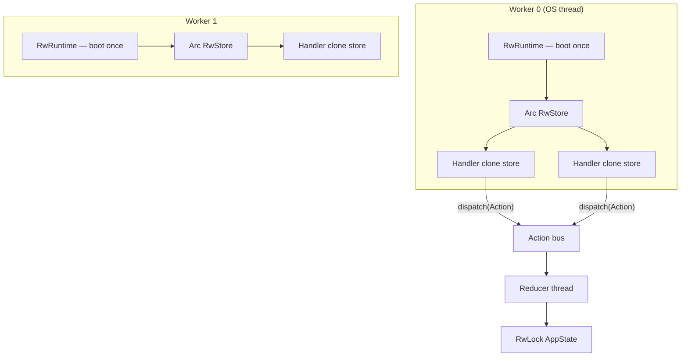

# API worker pattern — one runtime, cloned store handles

| Example | Role |
|---------|------|
| [`api_worker.rs`](../examples/api_worker.rs) | **Recommended server pattern** — one `RwRuntime` per worker, `store.clone()` per request |
| [`init_cost.rs`](../examples/init_cost.rs) | Why **not** to boot a runtime per HTTP request |
| [`read_correctness.rs`](../examples/read_correctness.rs) | Parallel Copy-only reads + replay verification |

```bash
cargo run -p rust-elm --example api_worker --release
```

---

## Problem

You have many concurrent HTTP (or gRPC, queue consumer) handlers and want Elm-style reducers. Two tempting approaches:

| Approach | Verdict |
|----------|---------|
| **New `Runtime` per request** | Wrong at scale — ~100–400 µs boot+shutdown each time ([init cost](../book/README.md#runtime-init-cost--can-you-boot-a-store-per-api-request)) |
| **One `Runtime` per worker, clone `Store`** | **Correct** — boot once, `dispatch` ~600 ns enqueue |

---

## Architecture



Each **worker** owns exactly **one** reducer thread and **one** Tokio pool. Handlers only share an `Arc<RwStore>` (or clone the handle — same cost).

---

## What the example does

1. Spawns **2 worker threads** (simulating 2 Actix/Axum workers).
2. Each worker calls `RwRuntime::from_program` **once**, wraps `rw_store()` in `Arc`.
3. Spawns **8 handler threads** per worker; each runs **25** fake requests.
4. Every request:
   - `store.dispatch(RecordRequest)` — global counter
   - `store.dispatch(OpenSession(id))` — lazy session row
   - optional `IncPageView` (every 3rd request)
   - **GET path:** `output_session()` — Copy-only read, no `AppState` clone
5. Asserts `total_requests` matches expected count, then `runtime.shutdown()`.

Session ids are unique per request so workers do not share session state across processes (real apps would use cookies/ JWT → session id in actions).

---

## Code map

### Boot once (worker start)

```rust
let runtime = RwRuntime::from_program(
    Program::new(init, update, subscriptions),
    Environment::new(),
    RuntimeConfig {
        bus_capacity: 4_096,
        worker_threads: 1,
        thread_name: "rust-elm-api",
    },
)?;
let store = Arc::new(runtime.rw_store());
```

Use `worker_threads: 1` when the worker is already one OS thread; the **host** runtime (Actix/tokio) runs async I/O.

### Handler — clone store, not runtime

```rust
fn handle_request(store: &RwStore<AppState, Action>, session_id: u64, post: bool) {
    store.dispatch(Action::RecordRequest);
    store.dispatch(Action::OpenSession(session_id));
    if post {
        store.dispatch(Action::IncPageView(session_id));
    }
    let _snap = output_session(store, session_id); // Copy-only GET
}
```

In Axum:

```rust
async fn track(
    State(store): State<Arc<RwStore<AppState, Action>>>,
    Path(session_id): Path<u64>,
) -> impl IntoResponse {
    store.dispatch(Action::IncPageView(session_id));
    let views = store.read_store().with_read(|s| {
        s.sessions.get(&session_id).map(|x| x.page_views).unwrap_or(0)
    });
    Json(views)
}
```

### Per-session state without per-request runtime

Sessions live **in reducer state**:

```rust
struct AppState {
    sessions: HashMap<u64, Session>,
    total_requests: u64,
}
```

Actions carry `session_id` from the HTTP layer. No second runtime per user.

---

## Mutex Store vs RwStore for APIs

| Backend | Use when |
|---------|----------|
| **`RwRuntime` / `RwStore`** | Handlers **read** state on thread pool (`read_store().with_read`) — typical REST GET |
| **`Runtime` / `Store`** | Writes dominate; few concurrent readers; or `binding()` on same thread |
| **`TeaRuntime`** | UI subscribers want channel-pushed snapshots — not typical for REST |

---

## Wiring in popular frameworks

| Framework | Where runtime lives | Handler access |
|-----------|--------------------|----------------|
| **Axum** | `main` or worker init → `Extension<Arc<RwStore>>` / `State` | Clone `Arc` per route |
| **Actix** | `HttpServer::new` closure — one `Runtime` per worker | `web::Data<Arc<RwStore>>` |
| **tokio::main** | Single process runtime | `Arc<RwStore>` into spawned tasks; `dispatch` is thread-safe |
| **Embedded / CLI** | `main` | Direct `store` reference |

Always **`dispatch` from handlers**; never call `update` directly in production (bypasses bus ordering and effect interpreter).

---

## Related

- [Runtime init cost](../book/README.md#runtime-init-cost--can-you-boot-a-store-per-api-request)
- [store.md](./store.md) — `dispatch`, `read_store`, scoping
- [`read_correctness.rs`](../examples/read_correctness.rs) — parallel Copy-only reads + replay verification
