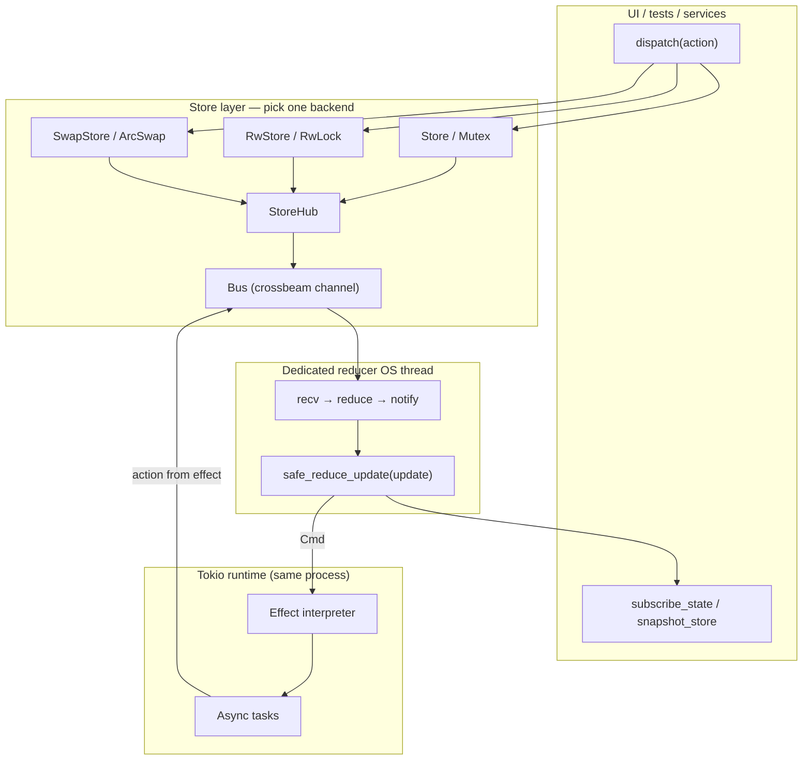
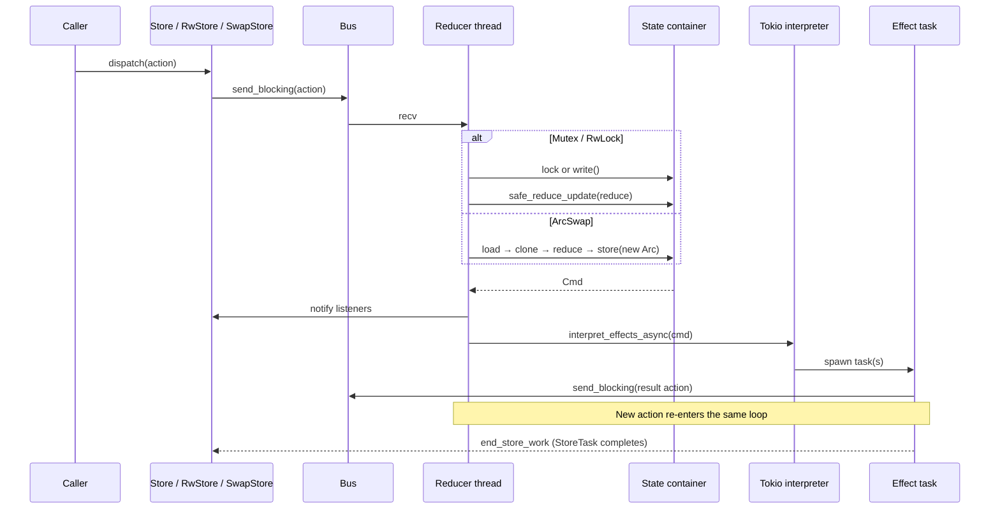
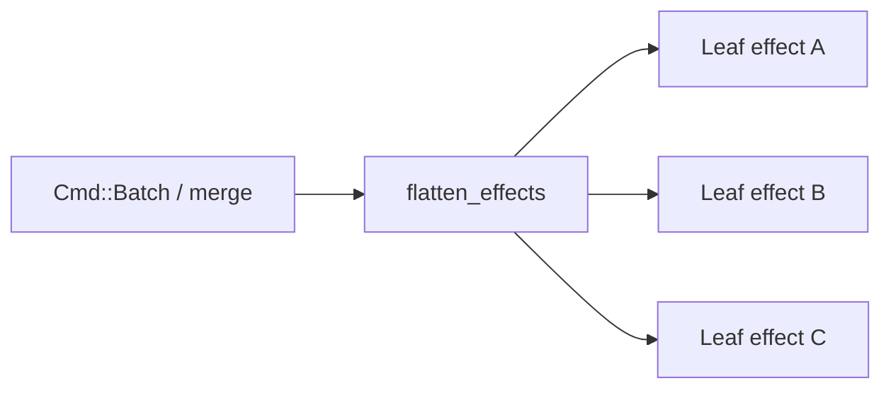
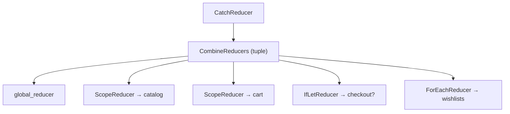
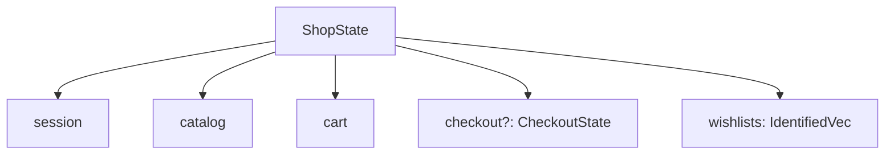
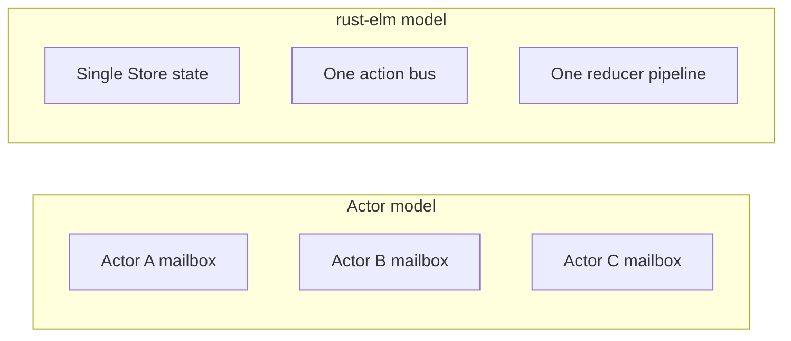
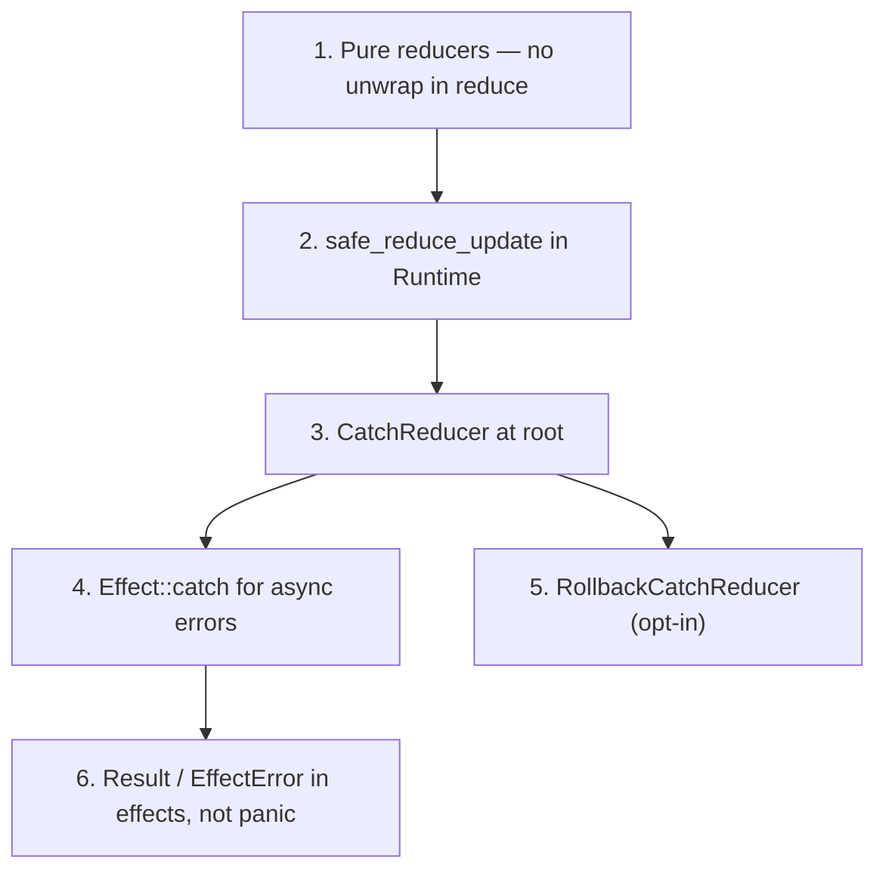
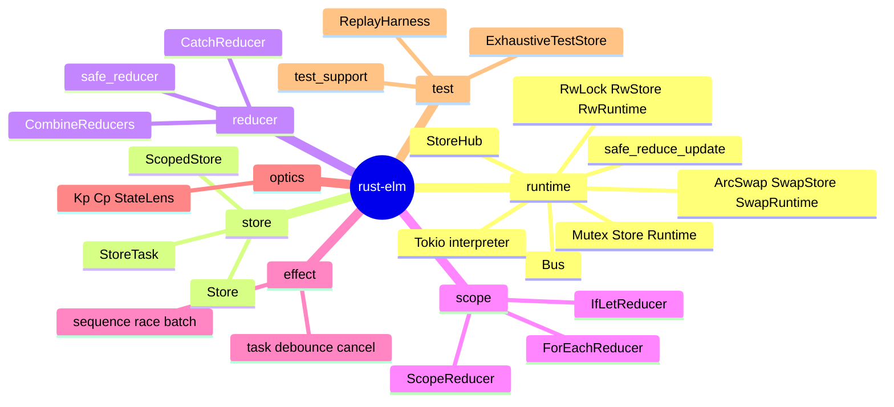

# rust-elm architecture

This document explains how **rust-elm** is structured, how work flows through the runtime, and how to choose between this model and alternatives (actors, raw async). For a full compositional example, see [`examples/ecommerce.rs`](../examples/ecommerce.rs).

---

## Design goals

rust-elm implements **Elm Architecture / UDF-style** state management in Rust:

- **Single source of truth** — one `State` value per store
- **Pure reducers** — `(state, action) → Cmd` with no I/O inside `reduce`
- **Declarative effects** — async work described as data, interpreted by the runtime
- **Composable reducers** — scope, optional children, collections, and combination

---

## System overview

rust-elm offers **three store backends** for the same bus + reducer-thread + Tokio interpreter stack. Pick based on read concurrency and whether `S: Clone` is affordable:

| Backend | State container | Read path | Write path | Feature |
|---------|-----------------|-----------|------------|---------|
| **`Store`** / `Runtime` | `Arc<Mutex<S>>` | lock | same lock | `runtime` (default) |
| **`RwStore`** / `RwRuntime` | `Arc<RwLock<S>>` | shared `read()` | exclusive `write()` on reducer | `runtime` |
| **`SwapStore`** / `SwapRuntime` | `Arc<ArcSwap<S>>` | lock-free `load()` | clone + atomic `store` | `arc-swap` |

All three share **`StoreHub`** (in `runtime/store.rs`) for dispatch, listener notify, and effect-done signaling.



For lock-free snapshot reads, see [swap_ecommerce.md](./swap_ecommerce.md). For concurrent `read()` without cloning `S`, see [rw_ecommerce.md](./rw_ecommerce.md).

| Component | Role |
|-----------|------|
| **`Store` / `RwStore` / `SwapStore`** | Public API: `dispatch`, `send` + `StoreTask`, `scope`, subscriptions |
| **`StoreHub`** | Shared dispatch hub: bus sender, listener lists, in-flight counter, interpreter |
| **`Bus`** | FIFO action queue between producers (UI, effects) and the reducer thread |
| **`Runtime` / `RwRuntime` / `SwapRuntime`** | Owns state container, bus, reducer thread, and Tokio interpreter |
| **`Reducer`** | Composable `reduce(&mut State, Action) → Cmd<Action>` |
| **`Cmd` / `Effect`** | Pure descriptions of async work returned from reducers |
| **`Environment`** | Live/test dependencies injected into env-scoped effects |

---

## Action lifecycle

One user or effect-driven action goes through this pipeline. The state step differs by backend:

| Backend | State step on reduce |
|---------|----------------------|
| `Store` (Mutex) | `lock` → mutate in place → `unlock` |
| `RwStore` (RwLock) | `write()` → mutate in place → drop guard |
| `SwapStore` (ArcSwap) | `load()` → clone `S` → mutate copy → `store(Arc::new(next))` |



**SwapStore readers** (parallel to the above): any thread calls `snapshot_store().load()` without entering this sequence — they observe the last published `Arc<S>`.

Important properties:

1. **Reducers always run on one dedicated thread**, one action at a time (serial).
2. **Effects never call `reduce` directly** — they enqueue a new action on the bus.
3. **`Store::send`** returns a `StoreTask` that completes when that action's effect tree finishes.
4. **`SwapStore` readers** never block the reducer and are never blocked by it (copy-on-write snapshots).

---

## Threading model

### Which thread runs what?

| Work | Thread |
|------|--------|
| `reduce` / state mutation | **Dedicated reducer thread** (spawned by `Runtime::bootstrap`) |
| Effect interpretation (spawn, debounce timers, cancel registry) | **Tokio worker threads** (multi-thread runtime created inside `Runtime`) |
| UI / test code calling `dispatch` | **Your thread** (typically main) |
| Actions produced by effects | Posted to bus from Tokio; **processed serially** on reducer thread |
| **`SwapStore` snapshot reads** | **Any thread** — `ArcSwap::load()` without locking `S` |
| **`RwStore` concurrent reads** | **Any thread** — shared `RwLock::read()` |

Effects are **not** executed on the reducer thread. After each reduce, the reducer thread `block_on`s effect spawning, then hands long-running work to Tokio:

```text
Reducer thread:  [reduce] → [spawn effects on Tokio] → [wait for next action]
Tokio threads:   [HTTP] [timer] [debounce] … → dispatch(action) → bus
```

So: **same process**, **different threads**. The reducer stays synchronous and cheap; I/O and timers live on Tokio.

---

## Effect concurrency: parallel vs sequential

When a reducer returns a `Cmd`, the interpreter **flattens** it to leaf effects and spawns them.



| Combinator | Behavior |
|------------|----------|
| **Multiple top-level leaves** (after flatten) | **Parallel** — each leaf gets its own Tokio task |
| **`Effect::Batch` / `Effect::Race`** | Children spawned **in parallel** |
| **`Effect::Sequence`** | Children run **sequentially** inside one task |
| **`Effect::Debounce` / `Throttle`** | Timer on Tokio; fires inner effect when gate opens |
| **`Effect::Cancellable { cancel_in_flight: true }`** | Aborts prior task with same id before starting new one |

**Reducer actions** are always **sequential** (one at a time from the bus). **Sibling effects** from a single `Cmd` are **parallel** unless wrapped in `Effect::Sequence`.

Example:

```rust
Cmd::batch([
    Cmd::single(Effect::task(1, fetch_user)),   // parallel
    Cmd::single(Effect::task(2, fetch_cart)),   // parallel
])
```

```rust
Cmd::single(Effect::sequence(vec![
    Effect::task(1, step_a),
    Effect::task(2, step_b),  // runs after step_a completes
]))
```

See `rust-elm/tests/effect_integration.rs` for debounce, cancel, and sequence coverage.

---

## Reducer composition



| Combinator | Use when |
|------------|----------|
| **`Reduce::new(fn)`** | Single feature slice |
| **`CombineReducers` / `reducers!`** | Sibling reducers on same state (each ignores unknown actions) |
| **`ScopeReducer`** | Nested struct + action casepath (`Kp` / `Cp` or manual lens) |
| **`IfLetReducer`** | Optional child (`Option<T>`); dismiss clears state + `Effect::cancel` |
| **`ForEachReducer`** | `IdentifiedVec` of children keyed by id |
| **`CatchReducer`** | Panic boundary (default: keep state, drop command) |
| **`RollbackCatchReducer`** | Opt-in checkpoint rollback on panic |

### Optics (`Kp` / `Cp`)

Derived keypaths focus state and embed/extract actions:

```rust
ScopeReducer::new(
    ShopState::catalog(),      // StateLens<ShopState, CatalogState>
    ShopAction::catalog_cp(),  // Casepath<ShopAction, CatalogAction>
    cancel_id,
    Reduce::new(catalog_reducer),
)
```

For `Option` fields or `ScopedStore` (which requires `Clone` on lenses), use fn-pointer lenses via `KpPath::new(get, get_mut)` — see the ecommerce cart/checkout lenses.

Child reducers should return **`Cmd<ChildAction>`**; `ScopeReducer` lifts commands into the parent action space.

---

## Ecommerce reference example

[`examples/ecommerce.rs`](../examples/ecommerce.rs) demonstrates a realistic shop:



**Four-level actions** (catalog path):

```text
ShopAction::Catalog(
  CatalogAction::Browse(
    BrowseAction::Product(
      ProductAction::Detail(DetailAction::Load { sku })
    )
  )
)
```

**Reducer stack** (6-way `CombineReducers` + `CatchReducer` — see [ecommerce.md](./ecommerce.md)):

1. `subscription_metrics_reducer` — root metrics for child subscription pulses
2. `detail_cart_bridge_reducer` — catalog detail → cart bridge
3. `global_reducer` — session, env, panic demo
4. `ScopeReducer` — catalog
5. `ScopeReducer` — cart
6. Nested pair — `IfLetReducer` (checkout) + `ForEachReducer` (wishlists)

Run it:

```bash
cargo run -p rust-elm --example ecommerce
```

---

## Actors vs rust-elm



| | **Actors** (e.g. `actix`, per-entity mailboxes) | **rust-elm** (Elm / UDF) |
|---|--------------------------------------------------|---------------------------|
| State | Sharded across actors | Single centralized tree (composed via scopes) |
| Concurrency | Many mailboxes processed in parallel | Reducer serial; effects parallel |
| Coupling | Message protocols between actors | Shared `State` + nested actions |
| Best for | Distributed systems, isolated services, back-pressure per entity | UI apps, predictable state replay, UDF-style features |
| Testing | Mock actor system | `ExhaustiveTestStore`, `ReplayHarness`, sync `test_runtime` |

**Use rust-elm when** you want one coherent app state, composable feature reducers, and Elm-like unidirectional data flow (mobile/desktop/web UI, game UI, local-first apps).

**Use actors when** you need independent failure domains, network-facing services, or truly parallel entity lifecycles without a shared mutable tree.

You can combine them: an actor can **dispatch** into a `Store` (external events → actions), but the store itself remains single-threaded reduce.

---

## Panic-free applications

rust-elm provides **layers** of resilience; none replace careful reducer/effect code.
See [safe_reducer.md](./safe_reducer.md) for the full API reference.



| Layer | What it does |
|-------|----------------|
| **`safe_reduce_update`** (Runtime default) | Catches reducer panics; **keeps state**; skips command |
| **`CatchReducer`** | Same policy at reducer-composition level + custom `recover` cmd |
| **`RollbackCatchReducer`** | Checkpoint swap on panic (opt-in revert) |
| **`Effect::catch`** | Map effect failure to recovery effect (not panic) |
| **`StoreWorkUnwindGuard`** | Ensures `StoreTask` doesn't hang if reduce aborts |

**Practices:**

1. Treat reducers as **pure**: no `unwrap`, no I/O, no blocking.
2. Use **`Result` in async effects**; surface failures as actions or `Effect::catch`.
3. Wrap the root in **`CatchReducer`** (Runtime already uses `safe_reduce_update`).
4. Use **`RollbackCatchReducer`** only when reverting state on panic is worth the clone cost.
5. Test with **`panic_on_state_clone!`** (see `test_support`) to catch accidental state copies in tests.
6. Prefer **`ReplayHarness`** for regression tests on action sequences.

See [`examples/safe_reducer.rs`](../examples/safe_reducer.rs) for panic vs rollback behavior.

---

## Module map



---

## Locks by design (not on state read hot path)

| Location | Lock | Why it stays |
|----------|------|--------------|
| `StoreHub::state_listeners`, `effect_done` | `Mutex` | register/wake listeners; not per-read |
| `InterpreterState` (cancel, debounce, throttle) | `Mutex` | Tokio effect bookkeeping |
| `SubscriptionHandles` | `Mutex` | subscription lifecycle |
| `RollbackCatchReducer::checkpoint` | `Mutex` | panic recovery only |
| `effect.rs` type-erasure registries | `std::Mutex` | registration at effect construction |

**Goal:** application state reads via `SwapStore::snapshot_store()` never touch these locks. See [todo.md](../../todo.md) for the full migration checklist.

---

## Related docs

- [README / quick start](../README.0.1.0.md)
- [store backends comparison](./store.md)
- [swap_ecommerce — lock-free reads](./swap_ecommerce.md)
- [rw_ecommerce — RwLock reads](./rw_ecommerce.md)
- [safe_reducer](./safe_reducer.md)
- [binding](./binding.md)
- [ROADMAP](../ROADMAP.md)
- [todo checklist](../../todo.md)
- [dependencies](../rust_dependencies/book/dependencies.md) — `Environment` / DI
- [identified collections](../rust_identified_vec/book/identified.md) — `ForEachReducer`
