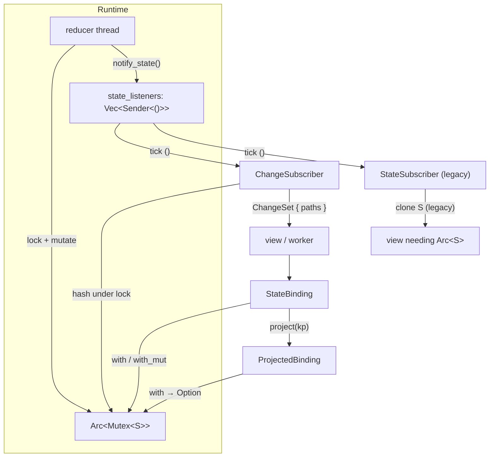

# Bindings and change signals

Zero-copy access to store state: read and write through the shared mutex, project
fields with keypaths (SwiftUI [`Binding` dynamic-member
lookup](https://developer.apple.com/documentation/swiftui/binding/subscript(dynamicmember:))),
and subscribe to **which fields changed** without cloning the whole tree.

For dispatch, scoping, and the legacy snapshot subscriber, see [store.md](./store.md).

---

## 1. Why bindings?

The classic store APIs clone state:

| API | Cost |
|-----|------|
| `store.state()` | deep clone of `S` every call |
| `subscribe_state()` | clone at subscribe + clone on every `next()` |
| `ScopedStateSubscriber` | clone parent, then clone focused child |

For large root state (shop catalog, payment trees, identified collections) that is
the hot cost. Bindings and change subscriptions fix it:

```
┌─────────────────────────────────────────────────────────────────┐
│  Arc<Mutex<S>>  ← single copy in the runtime                    │
│       ▲                                                         │
│       │ lock (shared)                                           │
│  StateBinding ──project(kp)──► ProjectedBinding ──► field       │
│       ▲                                                         │
│       │ same Arc                                                │
│  ChangeSubscriber ──► ChangeSet { paths: [Count, Label] }     │
│       (hashes only — no Arc<S>, no clone)                       │
└─────────────────────────────────────────────────────────────────┘
```

---

## 2. `StateBinding` — root access without clone

```rust
let binding = store.binding();

// read under lock
let count = binding.with(|app| app.count);

// write under lock
binding.with_mut(|app| app.count += 1);
```

- Holds `Arc<Mutex<S>>` — same mutex the reducer uses.
- `Clone` is cheap (Arc bump only).
- Never clones `S`.

`ScopedStore::binding()` returns a `ProjectedBinding` focused on the child slice.

---

## 3. Keypath projection (dynamic member lookup)

Project a property into its own binding. Reads and writes go through the **original**
store mutex — like SwiftUI projecting `currentPosition` and `isFavorite` from an
`Episode` binding into controls that each accept a narrower binding type.

```rust
use key_paths_derive::{FieldDiff, Kp};

#[derive(Kp, Hash, FieldDiff, Clone)]
struct Episode {
    current_position: i32,
    is_favorite: bool,
}

let root = store.binding();
let position = root.project(episode_position_kp()); // fn-pointer or derived Kp
let favorite = root.project(episode_favorite_kp());

if let Some(p) = position.with(|v| *v) {
    update_slider(p);
}
favorite.with_mut(|f| *f = toggle_on);
```

### Nested fields — `ComposedBinding`

Chain two keypath segments (e.g. `AppState::counter().then(CounterState::value())`):

```rust
let counter = store.binding().project(AppState::counter());
let value = counter.project(CounterState::value()); // consumes counter binding
value.with_mut(|v| *v += 1);
```

### Safe navigation — no panics

`ProjectedBinding::with` / `with_mut` and `ComposedBinding::with` / `with_mut` return
`Option<R>`. When the keypath misses (`None` in an `Option` field, wrong enum case, etc.)
they return `None` instead of panicking:

```rust
if let Some(label) = scoped.binding().with(|child| child.title.clone()) {
    render_title(label);
} else {
    render_empty();
}
```

Root `StateBinding::with` / `with_mut` always succeed — the whole `S` is present.

---

## 4. `subscribe_changes` — signals, not snapshots

Requires `S: FieldDiff + Hash`. Derive field tracking alongside keypaths:

```rust
#[derive(Kp, Hash, FieldDiff, Clone, PartialEq)]
struct App {
    count: i32,
    label: String,
}
// generates AppField::{Count, Label}
```

Subscribe:

```rust
let mut sub = store.subscribe_changes();

store.dispatch(Action::Inc);

if let Some(change) = sub.wait_next(Duration::from_secs(1)) {
    for path in change.paths {
        match path {
            AppField::Count => {
                if let Some(n) = sub.binding().with(|s| s.count) {
                    render_count(n);
                }
            }
            AppField::Label => { /* read label via sub.binding() */ }
        }
    }
}
```

### What the subscriber stores

| Field | Size | Purpose |
|-------|------|---------|
| `last_hash` | `Option<u64>` | root hash dedup |
| `last_fields` | `Vec<(Path, u64)>` | one u64 per field |
| `state` | `Arc<Mutex<S>>` | read on demand via `sub.binding()` |

No `Arc<S>`. No `state.lock().clone()`.

### Dedup logic

1. Coalesce channel ticks (same as `StateSubscriber`).
2. Hash root + each field under the lock.
3. If root hash unchanged → skip.
4. Emit only paths whose field hash changed.

### Scoped child — `ScopedStore::subscribe_changes`

Hashes the **focused child** under the parent lock (`CS: FieldDiff`). If the child is
absent at subscribe time (e.g. `Option::None`), the subscriber starts with empty field
tracking and begins emitting once the child appears — same safe pattern as
`ScopedStateSubscriber` skipping missing snapshots.

```rust
let cart = store.scope(ShopState::cart(), ShopAction::cart_cp());
let mut sub = cart.subscribe_changes();

cart.dispatch(CartAction::AddItem(id));
if let Some(change) = sub.wait_next(timeout) {
    for path in change.paths { /* CartField::* */ }
    sub.binding().with(|cart| render(cart));
}
```

---

## 5. `FieldDiff` trait

Defined in `key-paths-core`, derived with `#[derive(FieldDiff)]`:

```rust
pub trait FieldDiff: Hash {
    type Path: Copy + Eq + Hash + Send + Sync + 'static;
    fn field_hashes(&self, out: &mut Vec<(Self::Path, u64)>);
}
```

Each field is hashed independently via FNV-1a (`key_paths_core::hash_value`). Field
types must implement `Hash` (use integer ids instead of `f64` where needed).

Pair with `#[derive(Kp)]` so views can focus changed paths with the same keypath
accessors used for scoping and reducers.

---

## 6. Migration guide

| Old (clone path) | New (zero-copy path) |
|------------------|----------------------|
| `store.state().count` | `store.binding().with(\|s\| s.count)` |
| `subscribe_state()` + render whole tree | `subscribe_changes()` + render changed paths |
| `scoped.child_state()` | `scoped.binding().with(\|c\| ...)` |
| Compare `PartialEq` on full `S` | Compare per-field u64 hashes |

Keep `subscribe_state()` when you genuinely need an owned snapshot (tests, diffing whole
trees, sending state across threads without holding the lock). For UI loops and hot
readers, prefer bindings + change signals.

---

## 7. Architecture diagram



---

## 8. Quick reference

| Task | API |
|------|-----|
| Zero-copy root read/write | `store.binding()` → `with` / `with_mut` |
| Project field | `binding.project(kp)` → `ProjectedBinding` |
| Nested project | `projected.project(sub_kp)` → `ComposedBinding` |
| Safe optional field | `projected.with(\|v\| ...)` → `Option<R>` |
| Field change subscription | `store.subscribe_changes()` → `next()` / `wait_next()` |
| Read after change signal | `sub.binding().with(...)` |
| Scoped binding | `scoped.binding()` |
| Scoped change subscription | `scoped.subscribe_changes()` |
| Derive field paths | `#[derive(Kp, Hash, FieldDiff)]` |
| Legacy full snapshot | `store.subscribe_state()` (see [store.md](./store.md)) |

### RwLock (`RwStore`)

Same projection model on `Arc<RwLock<S>>`. Hold one [`RwStore`](./rw_ecommerce.md); call
`store.read_store()` for reader threads:

| Task | API |
|------|-----|
| Root read (many threads) | `store.read_store().with_read(f)` |
| Root read/write binding | `store.binding()` → `RwStateBinding` |
| Projected read | `read_store.read_binding().project(kp)` → `ReadProjectedBinding` |
| Projected write | `store.binding().project(kp)` → `RwProjectedBinding` |

See [rw_ecommerce.md](./rw_ecommerce.md) for the shop example.

---

## 9. Related

| Document | Topic |
|----------|-------|
| [store.md](./store.md) | Dispatch, scoping, `subscribe_state`, `StoreTask` |
| [safe_reducer.md](./safe_reducer.md) | `safe_reduce_update`, `CatchReducer`, rollback |
| [architecture.md](./architecture.md) | Runtime threading, reducer loop |
| [validation.md](./validation.md) | Keypath field validation |
| [`tests/store_changes_integration.rs`](../tests/store_changes_integration.rs) | Zero-clone tests with `panic_on_state_clone!` |
| [`src/runtime/binding.rs`](../src/runtime/binding.rs) | `StateBinding`, `ProjectedBinding`, `ComposedBinding`, `ReadStateBinding`, `RwStateBinding` |
| [`src/runtime/rw_store.rs`](../src/runtime/rw_store.rs) | `RwStore`, `ReadStore` |
| [`src/runtime/store.rs`](../src/runtime/store.rs) | `ChangeSubscriber`, `ChangeSet`, `ScopedChangeSubscriber` |
