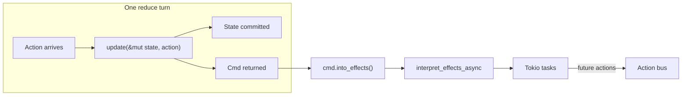
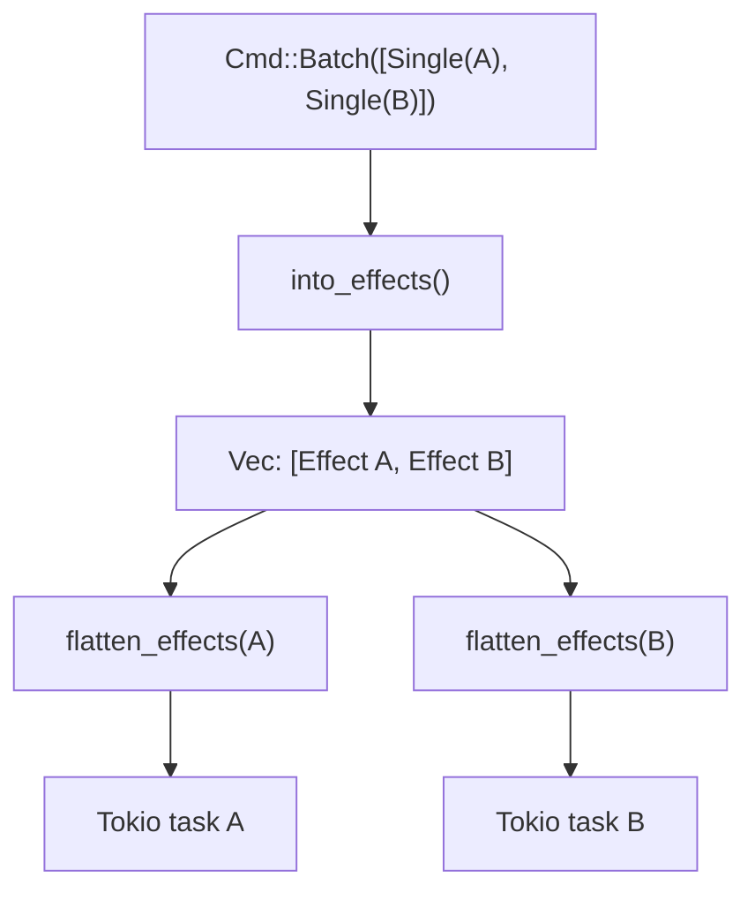
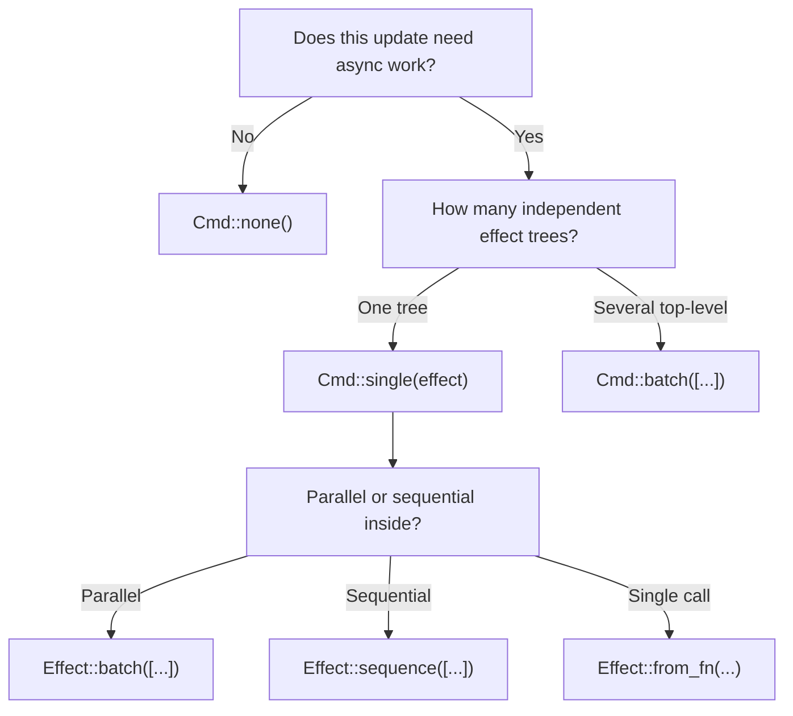

# Commands (`Cmd`) — architecture, theory, and everyday patterns

Every reducer turn ends with a **`Cmd<Action>`**: zero or more effects to run after state has been updated. `Cmd` is the **contract** between your pure `update` function and the runtime interpreter.

Source: [`src/core/cmd.rs`](../src/core/cmd.rs) · Companion: [effects.md](./effects.md) (what lives inside a command) · Wiring: [`src/core/program.rs`](../src/core/program.rs), [`src/runtime/engine.rs`](../src/runtime/engine.rs)

---

## The big picture

In Elm and rust-elm, **`update` never performs I/O**. It returns two things at once, conceptually:

1. **State mutation** — done synchronously inside `update`.
2. **Commands** — a value describing async work to schedule *after* this reduce turn commits.

```rust
fn update(state: &mut App, msg: Action) -> Cmd<Action> {
    match msg {
        Action::Refresh => {
            state.loading = true;
            Cmd::single(Effect::from_fn(|| Box::pin(async {
                Ok(Action::DataLoaded(fetch().await?))
            })))
        }
        Action::DataLoaded(data) => {
            state.loading = false;
            state.data = data;
            Cmd::none()   // state changed, no new async work
        }
    }
}
```



| Type | Role | Analogy |
|------|------|---------|
| **`Cmd<M>`** | “What should the runtime do after this update?” | Shell / imperative boundary |
| **`Effect<M>`** | “How should one piece of async work behave?” | Detailed IO blueprint inside a command |
| **`Sub<M>`** | “What ongoing listeners should stay active?” | Separate from `Cmd`; see [architecture.md](./architecture.md) |

**`Cmd` is intentionally small** — only `None`, `Single`, and `Batch`. Retry, debounce, sequence, timeout, and the rest live on **`Effect`**, usually wrapped in `Cmd::single(...)`.

---

## The `Cmd` type

```rust
pub enum Cmd<M> {
    None,
    Single(Effect<M>),
    Batch(Vec<Cmd<M>>),
}
```

| Variant | Meaning |
|---------|---------|
| **`None`** | No effects. State may still have changed. |
| **`Single(effect)`** | Run one effect tree (which may itself batch, sequence, debounce, …). |
| **`Batch(cmds)`** | Run multiple commands — their effects become **sibling** top-level effects. |

Constructors:

```rust
Cmd::none()                          // no work
Cmd::single(effect)                  // one effect tree
Cmd::batch([cmd_a, cmd_b, cmd_c])    // merge multiple commands
```

### Normalization in `Cmd::batch`

`batch` collapses trivial cases:

| Input | Result |
|-------|--------|
| `[]` | `Cmd::None` |
| `[one]` | `one` (unwraps singleton) |
| `[a, b, …]` | `Cmd::Batch(vec![a, b, …])` |

Same idea as `Effect::batch` — avoids pointless nesting.

---

## From `Cmd` to running tasks

After every `init()` and every `update()`, the runtime does:

```rust
let handles = interpret_effects_async(
    cmd.into_effects(),   // flatten Cmd tree → Vec<Effect>
    tx,
    env,
    handle,
    backend,
);
```

### `into_effects()` — flatten the command tree

```rust
pub fn into_effects(self) -> Vec<Effect<M>> {
    match self {
        Cmd::None => vec![],
        Cmd::Single(e) => vec![e],
        Cmd::Batch(cmds) => cmds.into_iter().flat_map(Cmd::into_effects).collect(),
    }
}
```

**Example:**

```rust
let cmd = Cmd::batch([
    Cmd::none(),                                    // dropped
    Cmd::single(Effect::from_fn(/* fetch user */)),
    Cmd::single(Effect::from_fn(/* fetch cart */)),
]);
// into_effects() → [Effect_user, Effect_cart]  — two top-level effects
```

Each element of that vector is then passed through `flatten_effects` (which expands `Effect::Batch` only). Each resulting leaf spawns on Tokio — **siblings run in parallel**.



### `init` commands

`Program::init` returns `(State, Cmd<Action>)`. Startup effects run **once** when the runtime boots — same interpreter path as `update`:

```rust
pub fn init() -> (ShopState, Cmd<ShopAction>) {
    (
        ShopState::default(),
        Cmd::single(env_probe_effect()),  // fetch config on launch
    )
}
```

See [`examples/ecommerce/shop.rs`](../examples/ecommerce/shop.rs) — `init` probes HTTP/date/WebSocket deps.

---

## `Cmd` vs `Effect` — two layers of “batch”

This is the most common source of confusion. Both can express parallel work:

| Expression | What happens |
|------------|--------------|
| `Cmd::batch([Cmd::single(e1), Cmd::single(e2)])` | Two top-level effects after `into_effects` — **parallel** |
| `Cmd::single(Effect::batch([e1, e2]))` | One top-level effect; interpreter spawns both children — **parallel** |
| `Cmd::single(Effect::sequence([e1, e2]))` | One top-level effect; **sequential** inside one task |
| `Cmd::none()` | Nothing runs |

**Rule of thumb:**

- Use **`Cmd::batch`** when **different reducers** (or logically separate commands) each return work — e.g. `CombineReducers`.
- Use **`Effect::batch`** when **one reducer** wants parallel IO as a single returned command.
- Use **`Effect::sequence`** when order matters inside one command.

For deep combinator semantics (race, debounce, fail-fast), see [effects.md](./effects.md).

---

## API reference

### `Cmd::none()`

The default for “I only changed state.”

**Daily life:** button click toggles bool, form field updates text, validation errors stored in state, navigation changes route without IO.

```rust
Action::ToggleDarkMode => {
    state.dark = !state.dark;
    Cmd::none()
}
```

Hot paths (throughput benchmarks, ingest loops) should almost always return `Cmd::none()` — see [README.md](./README.md) throughput section.

### `Cmd::single(effect)`

Wrap one effect tree.

**Daily life:** one HTTP request, one debounced search, one cancel signal, one sequenced pipeline.

```rust
Cmd::single(Effect::debounce(
    SEARCH_ID,
    Duration::from_millis(300),
    Effect::from_fn(/* ... */),
))
```

### `Cmd::batch(cmds)`

Merge multiple commands. After `into_effects`, all contained effects are **siblings** (parallel unless a sibling is `Effect::Sequence`).

**Daily life:**

- **`CombineReducers`** — each child reducer may return its own command; parent batches them.
- **Split concerns** — refresh user profile and sync analytics in the same action handler.
- **Cancel + fetch** — rare pattern of two independent one-shot effects.

```rust
Action::OpenDashboard => Cmd::batch([
    Cmd::single(Effect::cancel(STALE_FETCH_ID)),
    Cmd::single(Effect::batch([
        Effect::from_fn(/* user */),
        Effect::from_fn(/* cart */),
        Effect::from_fn(/* notifs */),
    ])),
])
```

### `Cmd::map(f: fn(M) -> N)`

Transform the **action type** carried by every effect in the command ( functor map ). Uses **function pointers** — same constraint as `Effect::map`.

**Daily life:** scoping — lift child actions into parent enum:

```rust
// child returns Cmd<ChildAction>
lift_cmd(child_cmd, ParentAction::Child)  // → Cmd<ParentAction>

// or directly:
child_cmd.map(ParentAction::Child)
```

`Cmd::map` also collapses `Single(Effect::None)` → `Cmd::None`.

Used by [`ScopeReducer`](../src/compose/scope.rs), [`ForEachReducer`](../src/compose/scope.rs), and [`component::lift`](../src/compose/component.rs).

### `Cmd::is_none()`

Quick check — no effects scheduled.

### `Cmd::effect_count()`

Counts `Single` nodes in the **Cmd tree** (not flattened effect leaves). Useful in tests and [`replay`](../src/infra/replay.rs) logging:

```rust
assert_eq!(cmd.effect_count(), 1);
```

Note: `Cmd::single(Effect::batch([a, b, c]))` has `effect_count() == 1` (one Single), but `into_effects().len() == 1` (one effect tree that expands to three parallel leaves).

---

## How composition uses `Cmd`

### `Reducer` trait

Every composable reducer returns `Cmd<Action>`:

```rust
pub trait Reducer {
    type State;
    type Action;
    fn reduce(&self, state: &mut Self::State, action: Self::Action) -> Cmd<Self::Action>;
}
```

Your plain `fn update(...) -> Cmd<A>` implements `Reducer` via blanket impl — zero-cost on the hot path.

### `CombineReducers` — batch commands from siblings

When one action fans out to multiple reducers, commands are **merged**, not discarded:

```rust
fn reduce(&self, state: &mut S, action: A) -> Cmd<A> {
    Cmd::batch([
        r1.reduce(state, action.clone()),
        r2.reduce(state, action.clone()),
        r3.reduce(state, action.clone()),
    ])
}
```

**Real life — ecommerce shop:** metrics reducer, cart bridge, global reducer, catalog scope, cart scope, checkout scope — all run on the same `ShopAction`; each returns `Cmd::none()` or scoped effects; `CombineReducers` batches any non-empty commands.

Only matching scopes produce effects; others return `Cmd::none()` and disappear from the batch.

### `ScopeReducer` / `IfLetReducer` / `ForEachReducer`

Child `Cmd<ChildAction>` is **lifted** to `Cmd<ParentAction>`:

- **`map`** embeds child result actions into parent enum (`ShopAction::Catalog(...)`).
- **`tag_cancel_id`** attaches cancellation scope so dismiss/remove aborts in-flight child work.

```rust
// IfLet dismiss — cancel without running child update
if dismiss(action) {
    clear(state);
    return Cmd::single(Effect::cancel(CHECKOUT_CANCEL_ID));
}
```

### `CatchReducer` / panic recovery

On reducer panic, **`recover` returns a `Cmd`** — you can schedule logging effects, user notifications, or nothing:

```rust
CatchReducer::new(inner, |err| {
    Cmd::single(Effect::from_fn(|| Box::pin(async {
        Ok(Action::ReducerCrashed(err.message().unwrap_or("unknown").into()))
    })))
})
```

Default pattern in examples: `|_| Cmd::none()`.

---

## Cookbook — everyday `Cmd` patterns

### 1. Pure state update — no IO

```rust
Action::Increment => {
    state.count += 1;
    Cmd::none()
}
```

### 2. Single async request

```rust
Action::Load => {
    state.loading = true;
    Cmd::single(Effect::from_fn(|| Box::pin(async {
        Ok(Action::Loaded(api.get().await?))
    })))
}
```

### 3. Parallel fetches (one reducer, one command)

```rust
Action::LoadAll => Cmd::single(Effect::batch([
    Effect::from_fn(/* user → Action::UserLoaded */),
    Effect::from_fn(/* cart → Action::CartLoaded */),
    Effect::from_fn(/* prefs → Action::PrefsLoaded */),
]))
```

Reducer joins partial results on each arriving action (see [effects.md — parallel join](./effects.md)).

### 4. Parallel fetches (explicit Cmd siblings)

Equivalent intent, different shape:

```rust
Action::LoadAll => Cmd::batch([
    Cmd::single(Effect::from_fn(/* user */)),
    Cmd::single(Effect::from_fn(/* cart */)),
    Cmd::single(Effect::from_fn(/* prefs */)),
])
```

### 5. Sequential pipeline (ordered steps)

```rust
Action::Checkout => Cmd::single(Effect::sequence([
    Effect::from_fn(/* validate → Action::Validated */),
    Effect::from_fn(/* pay → Action::Paid */),
    Effect::from_fn(/* confirm → Action::Done */),
]))
```

Remember: for **fail-fast**, use one `from_fn` with `?` — see [effects.md](./effects.md).

### 6. Startup load in `init`

```rust
fn init() -> (App, Cmd<Action>) {
    (App::default(), Cmd::single(Effect::from_fn(|| Box::pin(async {
        Ok(Action::BootConfigLoaded(load_config().await?))
    }))))
}
```

### 7. Cancel in-flight work on navigation

```rust
Action::RouteChanged(route) => {
    state.route = route;
    Cmd::single(Effect::cancel(PAGE_FETCH_ID))
}
```

Or combine with new fetch:

```rust
Cmd::batch([
    Cmd::single(Effect::cancel(PAGE_FETCH_ID)),
    Cmd::single(Effect::cancellable(PAGE_FETCH_ID, fetch_effect_for(route))),
])
```

### 8. Multiple reducers, one fires an effect

```rust
// CombineReducers — only catalog scope matches ShopAction::Catalog(...)
// Final cmd might be:
Cmd::single(Effect::debounce(...))  // from catalog reducer only
// Other slots returned Cmd::none() — batch normalizes to Single
```

### 9. Lift child command in manual composition

```rust
fn parent_update(state: &mut Parent, msg: ParentAction) -> Cmd<ParentAction> {
    match msg {
        ParentAction::Child(c) => {
            let cmd = child_update(&mut state.child, c);
            cmd.map(ParentAction::Child)
        }
        // ...
    }
}
```

Or use `Slot::lift` from [`component.rs`](../src/compose/component.rs).

### 10. Test: assert command shape without running Tokio

```rust
let cmd = reducer.reduce(&mut state, Action::Load);
assert!(!cmd.is_none());
assert_eq!(cmd.effect_count(), 1);
```

Run full effect cycles with `ExhaustiveTestStore` — it calls `cmd.into_effects()` after each `send` / `receive`.

---

## `Cmd` and store lifecycle

When `Store::send` dispatches an action:

1. Action queued on bus.
2. Reducer thread runs `update` → `Cmd`.
3. State published / listeners notified.
4. `cmd.into_effects()` interpreted on Tokio.
5. If there are join handles, `StoreWork` stays active until tasks complete (or fire-and-forget for empty cmd).

**Implication:** a burst of actions each returning heavy `Cmd`s queues **many** parallel Tokio tasks. Throttle at the **Effect** layer (debounce/throttle/cancellable) or return `Cmd::none()` when already loading.

---

## Decision guide



| Question | Answer |
|----------|--------|
| Only mutating state? | `Cmd::none()` |
| One HTTP call? | `Cmd::single(Effect::from_fn(...))` |
| Three parallel APIs, one reducer? | `Cmd::single(Effect::batch([...]))` |
| Three parallel APIs, three reducers? | `CombineReducers` → automatic `Cmd::batch` |
| Ordered steps with UI between each? | `Cmd::single(Effect::sequence([...]))` |
| Stop entire chain on first error? | `Cmd::single(Effect::from_fn` + `?`)` |
| Child feature in parent app? | `child_cmd.map(ParentAction::Child)` |
| App startup fetch? | Return effect from `init()` |
| Dismiss modal / remove list item? | `Cmd::single(Effect::cancel(id))` |

---

## Common mistakes

### Returning effects without updating state first

```rust
// awkward — loading flag set when result arrives, UI lags one frame
Action::Load => Cmd::single(Effect::from_fn(...))

// better — set loading immediately, then fetch
Action::Load => {
    state.loading = true;
    Cmd::single(Effect::from_fn(...))
}
```

### Using `Cmd::batch` when you need sequencing

`Cmd::batch` always produces **parallel** top-level effects. For strict ordering, use **`Cmd::single(Effect::sequence(...))`** or one `from_fn` with chained awaits.

### Nesting redundant batches

```rust
// works but noisy
Cmd::batch([Cmd::single(Effect::batch([a, b]))])

// clearer
Cmd::single(Effect::batch([a, b]))
```

Both run `a` and `b` in parallel; prefer the flatter form unless merging from `CombineReducers`.

### Expecting `effect_count()` to count parallel leaves

`effect_count()` counts **`Cmd::Single` nodes**, not inner `Effect::Batch` leaves. Use `into_effects()` + inspect effect shape for precise assertions.

### Forgetting `init` can return commands

If boot-time loading never fires, check that `init()` returns the effect — not just `Cmd::none()`.

---

## Elm / Redux parity

| rust-elm | Elm | Redux (analogy) |
|----------|-----|-----------------|
| `Cmd::none()` | `Cmd.none` | no middleware follow-up |
| `Cmd::single(effect)` | `Cmd` with one effect | single async middleware invocation |
| `Cmd::batch([...])` | `Cmd.batch` | multiple parallel dispatches |
| `into_effects()` | (runtime internal) | — |
| `Cmd::map` | `Cmd.map` | lift action type |

---

## Related reading

| Doc | Topic |
|-----|-------|
| [effects.md](./effects.md) | Every effect combinator, race/join recipes, debounce/throttle |
| [architecture.md](./architecture.md) | Reducer thread vs Tokio, `Sub` vs `Cmd` |
| [safe_reducer.md](./safe_reducer.md) | Panic recovery and what `recover` returns |
| [store.md](./store.md) | `dispatch`, `StoreTask`, async completion |
| [`tests/effect_integration.rs`](../tests/effect_integration.rs) | End-to-end Cmd + Effect behavior |

**Mental model:** `Cmd` answers *“should we do anything async after this update?”* — `Effect` answers *“how exactly should that async work run?”* Keep commands at the reducer boundary; push orchestration detail into effects.
