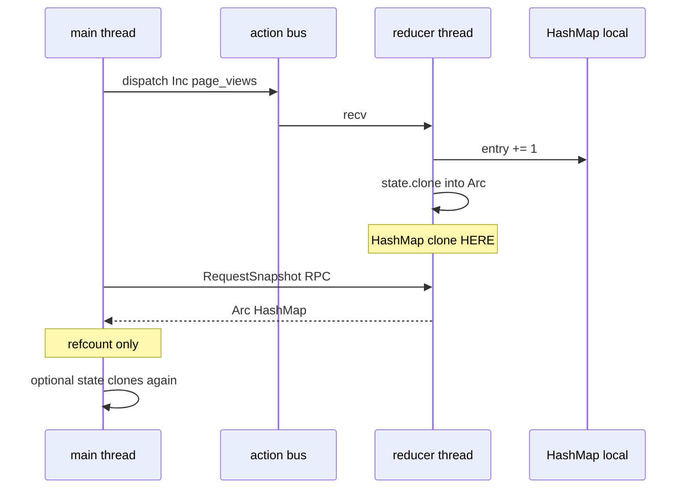

# Counter examples — `HashMap` buckets on TeaStore vs RwStore

| Example | Backend | When to use |
|---------|---------|-------------|
| [`counter.rs`](../examples/counter.rs) | `TeaRuntime` / `TeaStore` | True TEA — channel-pushed model, no shared lock |
| [`rw_counter.rs`](../examples/rw_counter.rs) | `RwRuntime` / `RwStore` | **Zero-clone reads** of one bucket via `read_binding` |

```bash
cargo run -p rust-elm --example counter
cargo run -p rust-elm --example rw_counter
```

---

## State and actions

Root state holds three buckets (`a`, `b`, `c`):

```rust
struct CounterState {
    a: HashMap<String, u64>,
    b: HashMap<String, u64>,
    c: HashMap<String, u64>,
}

enum CounterAction {
    A(BucketAction),
    B(BucketAction),
    C(BucketAction),
}
```

Use `store.scope(b_lens(), CounterAction::b_cp())` to dispatch only to bucket `b`.

---

## TeaStore (`counter`) — reducer clones full root

Even `try_with_snapshot(|s| s.b.get(...))` **borrows on main without cloning**, but the
reducer already ran `Arc::new(state.clone())` — **entire `CounterState`** including all
three maps.

See clone table in [`examples/counter.rs`](../examples/counter.rs).

---

## RwStore (`rw_counter`) — borrow under read lock, no struct clone

```rust
// borrow field b — CounterState is NOT cloned
let n = store.read_store().with_read(|s| s.b.get("page_views").copied().unwrap_or(0));

// keypath-scoped binding — still no clone
let b_scope = store.scope(b_lens(), CounterAction::b_cp());
let n = b_scope.read_binding().with_read(|b| b.get("page_views").copied().unwrap_or(0));
```

`rw_counter` uses `panic_on_state_clone!` so the example **panics** if a read path
accidentally clones `CounterState`.

Avoid on hot paths: `store.state()` and `subscribe_state().next()` — both clone the full struct.

---

## Reading snapshots on TeaStore (legacy single-map notes)

### 1. RPC — `view_store().try_load()` (recommended for one-off reads)

```rust
let snap: Arc<HashMap<String, u64>> = store.view_store().try_load()?;
let n = snap.get("page_views").copied().unwrap_or(0);
```

Main thread **blocks** until the reducer replies.  
**Clone location:** reducer thread runs `Arc::new(state.clone())` — **full `HashMap` clone on reducer**.  
Main receives `Arc` — **refcount only**, no second map clone.

### 2. RPC borrow — `try_with_snapshot`

```rust
let n = store.view_store().try_with_snapshot(|m| m.get("page_views").copied().unwrap_or(0))?;
```

Same RPC as `try_load`, but you only borrow through `Arc` on main — **no extra clone on main**.

### 3. Push — `subscribe_state()`

```rust
let mut sub = store.subscribe_state()?;
store.dispatch(CounterAction::Inc("page_views".into()));
if let Some(snap) = sub.wait_next(Duration::from_secs(1)) {
    // snap: Arc<HashMap<...>>
}
```

After each `Inc` / `Dec`, the reducer **pushes** `Arc::new(state.clone())` on a channel.  
**Clone location:** **reducer thread** (same as above).  
Main **recv** gets `Arc` — cheap.

### Avoid on hot paths: `store.state()`

```rust
let owned: HashMap<String, u64> = store.state()?; // clones map again on MAIN
```

Reducer still clones once to build `Arc`; then main **clones the whole map out of the Arc**.

---

## Clone summary

| Step | Thread | What is cloned |
|------|--------|----------------|
| `reduce` (Inc/Dec) | Reducer | in-place mutate local `HashMap` — no publish clone yet |
| `publish_snapshots` / RPC reply | **Reducer** | **`HashMap` → `Arc::new(state.clone())`** |
| `try_load()` / `subscribe.next()` on main | Main | **`Arc` refcount only** |
| `try_with_snapshot(\|m\| …)` on main | Main | **borrow** — no clone |
| `state()` on main | Main | **second full `HashMap` clone** |



---

## Related

- [rw_ecommerce.md](./rw_ecommerce.md) — RwStore read bindings in a full app
- [binding.md](./binding.md) — `StateBinding` / `read_binding` zero-clone pattern
- [tea_ecommerce.md](./tea_ecommerce.md) — full TeaStore architecture
- [README snapshot section](../README.0.1.0.md#snapshot-reads-blocking-vs-background) — threading overview
