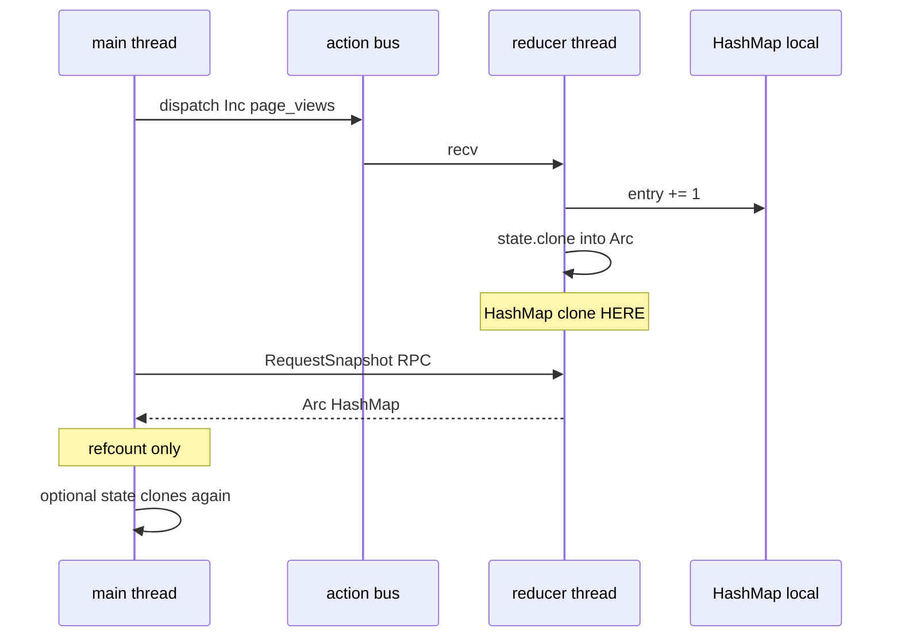

# Counter example — `HashMap<String, u64>` on TeaStore

Companion to [`examples/counter.rs`](../examples/counter.rs).

```bash
cargo run -p rust-elm --example counter
```

---

## State and actions

```rust
type Counters = HashMap<String, u64>;

enum CounterAction {
    Inc(String),  // counters[key] += 1 (insert 0 first)
    Dec(String),  // counters[key] saturating_sub 1
}
```

The live map exists **only on the reducer thread**. `main` holds a [`TeaStore`](./tea_ecommerce.md) handle and dispatches actions.

---

## Reading snapshots (three APIs)

### 1. RPC — `view_store().try_load()` (recommended for one-off reads)

```rust
let snap: Arc<HashMap<String, u64>> = store.view_store().try_load()?;
let n = snap.get("page_views").copied().unwrap_or(0);
```

Main thread **blocks** until the reducer replies.  
**Clone location:** reducer thread runs `Arc::new(state.clone())` — **full `HashMap` clone on reducer**.  
Main receives `Arc` — **refcount only**, no second map clone.

### 2. RPC borrow — `try_with_snapshot`

```rust
let n = store.view_store().try_with_snapshot(|m| m.get("page_views").copied().unwrap_or(0))?;
```

Same RPC as `try_load`, but you only borrow through `Arc` on main — **no extra clone on main**.

### 3. Push — `subscribe_state()`

```rust
let mut sub = store.subscribe_state()?;
store.dispatch(CounterAction::Inc("page_views".into()));
if let Some(snap) = sub.wait_next(Duration::from_secs(1)) {
    // snap: Arc<HashMap<...>>
}
```

After each `Inc` / `Dec`, the reducer **pushes** `Arc::new(state.clone())` on a channel.  
**Clone location:** **reducer thread** (same as above).  
Main **recv** gets `Arc` — cheap.

### Avoid on hot paths: `store.state()`

```rust
let owned: HashMap<String, u64> = store.state()?; // clones map again on MAIN
```

Reducer still clones once to build `Arc`; then main **clones the whole map out of the Arc**.

---

## Clone summary

| Step | Thread | What is cloned |
|------|--------|----------------|
| `reduce` (Inc/Dec) | Reducer | in-place mutate local `HashMap` — no publish clone yet |
| `publish_snapshots` / RPC reply | **Reducer** | **`HashMap` → `Arc::new(state.clone())`** |
| `try_load()` / `subscribe.next()` on main | Main | **`Arc` refcount only** |
| `try_with_snapshot(\|m\| …)` on main | Main | **borrow** — no clone |
| `state()` on main | Main | **second full `HashMap` clone** |



---

## Related

- [tea_ecommerce.md](./tea_ecommerce.md) — full TeaStore architecture
- [README snapshot section](../README.0.1.0.md#snapshot-reads-blocking-vs-background) — threading overview
