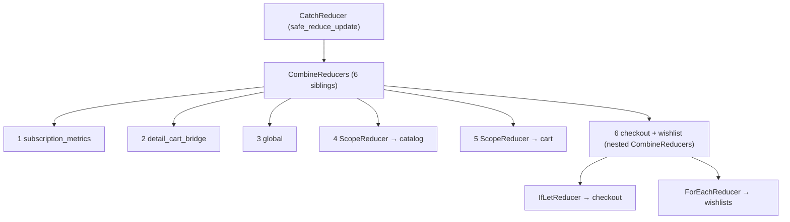
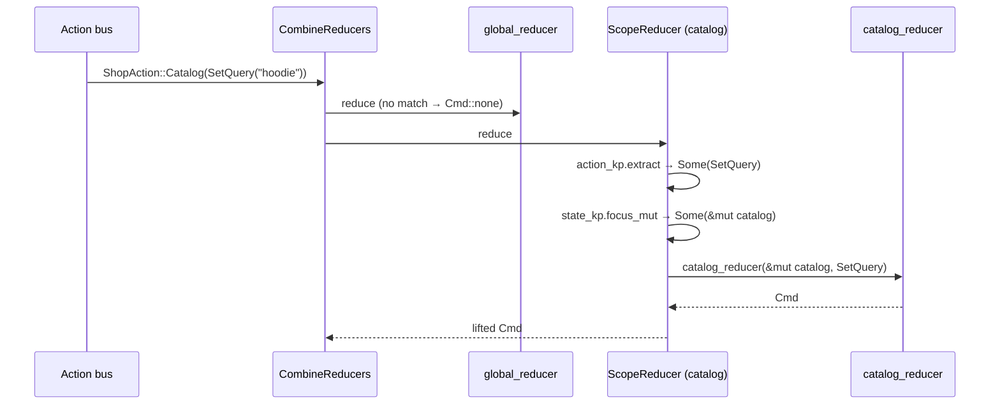
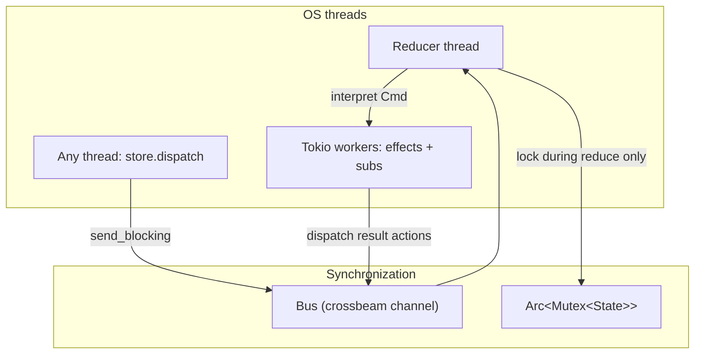
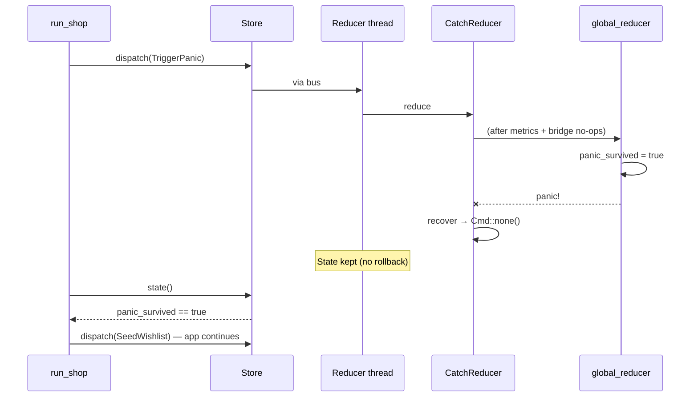
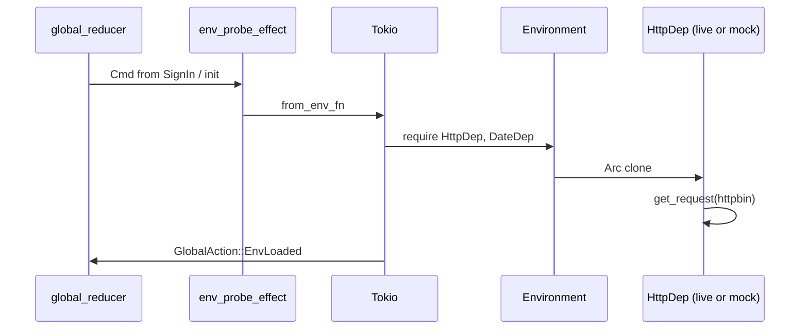
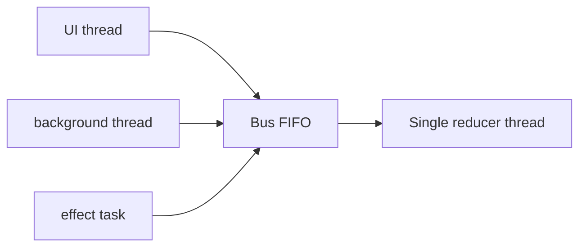

# Ecommerce example — architecture guide

Companion to [`examples/ecommerce.rs`](../examples/ecommerce.rs). Run it:

```bash
cargo run -p rust-elm --example ecommerce
```

For runtime internals (bus, Tokio, general UDF flow), see [architecture.md](./architecture.md).

---

## What this example demonstrates

| Feature | Where |
|---------|--------|
| 4-level nested actions | `ShopAction::Catalog → Browse → Product → Detail` |
| 6 sibling reducers | `CombineReducers` tuple (library limit extended to **6**) |
| Scoped children | `ScopeReducer` (catalog, cart) |
| Optional child | `IfLetReducer` (checkout sheet) |
| Collection child | `ForEachReducer` (wishlists) |
| Cross-scope bridge | `detail_cart_bridge_reducer` |
| Root metrics from child subs | `subscription_metrics_reducer` |
| All five `Sub` varieties | tick, stream, websocket, map_msg, batch |
| Dependency injection | `Environment` + live/mock HTTP + date |
| Panic recovery | `GlobalAction::TriggerPanic` + `CatchReducer` (`safe_reduce_update`) |

---

## Reducer stack (6-way)



Slot 6 nests checkout + wishlist because the flat tuple is capped at six siblings; nested `CombineReducers` is the standard way to grow beyond that without losing composition.

---

## Scoped child reducers — will they be called?

**Short answer:** every reducer in `CombineReducers` runs on **every** action. A **scoped** child only *mutates* state when the action matches its casepath **and** the state lens can focus.



### If you **remove** `ScopeReducer` and call `catalog_reducer` directly on `ShopState`

| Question | Answer |
|----------|--------|
| Will `catalog_reducer` run? | Only if **you** wire it into `CombineReducers` and pass `ShopAction` through a wrapper |
| Will it compile as-is? | **No** — signature is `fn(&mut CatalogState, CatalogAction)` |
| What if you add a manual `match` in a root reducer? | It runs, but you lose automatic action lifting, effect cancel ids, and `ScopedStore` |

### What `ScopeReducer` does on a non-matching action

```rust
// scope.rs — simplified
let Some(child_action) = self.action_kp.extract(&action) else {
    return Cmd::none();  // child reducer NOT called
};
let Some(child) = self.state_kp.focus_mut(state) else {
    return Cmd::none();  // child reducer NOT called (e.g. missing state)
};
self.child.reduce(child, child_action)
```

So for `ShopAction::Global(SignIn(..))`:

- `catalog_reducer` — **not called** (casepath extract fails)
- `cart_reducer` — **not called**
- `checkout_reducer` — **not called** (`IfLetReducer` same extract rules)
- `global_reducer` — **called**

For `ShopAction::Catalog(StreamPulse)`:

- `catalog_reducer` — **called** (no-op; metrics handled at root)
- `subscription_metrics_reducer` — **called** (increments counter)

### `IfLetReducer` extra rule

Checkout runs only when `state.checkout.is_some()`. If checkout is `None`, `focus_mut` fails → child **not called**, even for `ShopAction::Checkout(Pay)`.

---

## Subscriptions in a child scope

Subscriptions are declared at **program** level:

```rust
ReducerProgram::new(shop_reducer(), init, subscriptions)
//                                      ^^^^^^^^^^^^^ root: fn(&ShopState) -> Sub<ShopAction>
```

There is no built-in `subscriptions` on `ScopedStore`. Child-scoped subscriptions use one of these patterns:

### Pattern A — state-gated root subscriptions (used in ecommerce)


1. In `subscriptions`, read root state (`catalog.query`, `checkout.is_some()`, `session.user`).
2. Register `Sub` only when the child “exists”.
3. Produce **root** `ShopAction` variants (`Catalog::StreamPulse`, `Checkout::WsPulse`).
4. Let `ScopeReducer` / `IfLetReducer` route to the child (often a no-op there).
5. Handle cross-cutting concerns (metrics) in a **root** sibling reducer if needed.

### Pattern B — lift to `GlobalAction`

Map child pulses to global actions when only root state should change:

```rust
Sub::map_msg(
    Sub::tick(id, dur, || ()),
    |_| ShopAction::Global(GlobalAction::SubscriptionPing),
)
```

Child reducer stays untouched; `global_reducer` owns the metric.

### Pattern C — `ScopedStore` for dispatch only

UI / services hold `ScopedStore` and dispatch child actions; subscriptions still emit root actions (A or B). `ScopedStore` does not own subs today.

### Sync after reduce

After each successful reduce, the runtime calls `sync_subs` — subscriptions are **recomputed** from the new state. Starting checkout automatically starts the websocket sub; clearing it stops the sub.

---

## Action / effect locking — do you need locks?



| Concern | Lock needed by app code? | Mechanism |
|---------|--------------------------|-----------|
| Reducer mutating state | **No** | Single reducer thread; one action at a time |
| `store.dispatch` from UI / other threads | **No** | Channel enqueue; non-reentrant reduce |
| `store.state()` snapshot | **No** | Brief `Mutex` lock + clone inside runtime |
| Effects reading/writing app state | **No direct access** | Effects return actions; reducer applies them |
| Parallel sibling effects | **No** | Tokio; no state lock held during async work |
| Shared deps in `Environment` | **Usually no** | `Arc` services; use interior mutability only if the dep requires it |

**Rules for reducers:** keep them pure — no I/O, no `Mutex` in reduce. All concurrency is orchestrated by the runtime.

**Rules for effects:** use `Environment` deps; on failure return `Result` / `EffectError`, not panic.

---

## Panic end-to-end flow

The example dispatches `GlobalAction::TriggerPanic` after sign-in:

```rust
GlobalAction::TriggerPanic => {
    state.session.panic_survived = true;  // mutation committed before panic
    panic!("ecommerce demo: intentional reducer panic");
}
```



Layers involved:

1. **`safe_reduce_update`** (runtime) — catches unwind; state not reverted
2. **`CatchReducer`** — uses `safe_reduce_update`; logs `SafeReduceError`; returns `Cmd::none()` (effects from that turn dropped)
3. **`StoreWorkUnwindGuard`** — `StoreTask::finish` does not hang

Reducers **after** the panicking sibling in the same `CombineReducers` tuple **do not run** for that action. Here `global_reducer` is slot 3; catalog/cart/checkout never see `TriggerPanic`.

For rollback-on-panic, use `RollbackCatchReducer` / `safe_reduce_rollback` ([`examples/safe_reducer.rs`](../examples/safe_reducer.rs), [safe_reducer.md](./safe_reducer.md)).

---

## Dependency injection flow



Swap `shop_environment_live()` vs `shop_environment_mock()` at `Runtime::from_reducer_program` — no reducer changes.

---

## Is this production-grade?

**As an example: yes — it shows real composition patterns.**

**As a deployable ecommerce app: not without additional work.**

| Area | Example status | Production gap |
|------|----------------|----------------|
| State model | Rich demo | Persistence, migrations, schema versioning |
| Network | httpbin + **real WebSocket** (`tokio-tungstenite`, `websocket` feature) | TLS, auth, circuit breakers |
| Subscriptions | Interval-based simulation | Real WebSocket/Tokio streams, reconnect |
| Errors | Log + continue | User-visible error state, telemetry |
| Panics | Caught at root | Avoid panics in prod; use `Result` paths |
| Testing | Manual run | Property tests, `ReplayHarness`, CI |
| Security | N/A | Input validation, secrets management |

rust-elm **is suitable for production UI / local-first apps** when you add persistence, observability, and domain-specific hardening. This repo example is a **reference architecture**, not a shipped product.

---

## Accessing the store from other threads

`Store` is **`Clone` + `Send`**. Any thread can hold a clone and call:

```rust
let store = runtime.store();

// fire-and-forget
store.dispatch(ShopAction::Global(GlobalAction::SignIn(user)));

// wait for effects triggered by this action
store.send(action).finish()?;

// scoped child API
let cart = store.scope(cart_lens(), ShopAction::cart_cp());
cart.dispatch(CartAction::Line(0, CartLineAction::Inc));

// read snapshot (clones whole state under lock)
let snap = store.state();
```



### Will multi-threaded dispatch make it slow?

| Factor | Behavior |
|--------|----------|
| Reduce throughput | **Serialized** — one action fully reduced at a time |
| `dispatch` cost | Cheap: channel send (`send_blocking`) |
| Contention | Many threads dispatching → queue latency, not lock fighting on state |
| `state()` | Clones entire state; can be costly for huge trees — prefer `subscribe_state` or scoped reads |
| Effects | Run concurrently on Tokio; do not block the reducer thread |

For high-frequency producers, batch actions in the producer or use throttled/debounced effects rather than hammering `dispatch`.

---

## SOLID reducer layout (recap)

| Reducer | Single responsibility |
|---------|----------------------|
| `subscription_metrics_reducer` | Root counters for child subscription pulses |
| `detail_cart_bridge_reducer` | Catalog detail → cart line bridge |
| `global_reducer` | Session, checkout entry, wishlist seed, env, panic demo |
| `catalog_reducer` | Catalog + detail (scoped) |
| `cart_reducer` | Cart lines (scoped) |
| `checkout_reducer` / `wishlist_reducer` | Optional / collection children |

Each uses a **single `match`** on its action type; unknown variants return `Cmd::none()`.

---

## Related files

| File | Role |
|------|------|
| [`examples/ecommerce.rs`](../examples/ecommerce.rs) | Main program + demo scenario (`Runtime` / `Mutex`) |
| [`examples/ecommerce/shop.rs`](../examples/ecommerce/shop.rs) | Shared state, reducers, subscriptions |
| [`examples/rw_ecommerce.rs`](../examples/rw_ecommerce.rs) | Same shop on `RwRuntime` — see [rw_ecommerce.md](./rw_ecommerce.md) |
| [`examples/swap_ecommerce.rs`](../examples/swap_ecommerce.rs) | Same shop on `SwapRuntime` — see [swap_ecommerce.md](./swap_ecommerce.md) |
| [`examples/tea_ecommerce.rs`](../examples/tea_ecommerce.rs) | Same shop on `TeaRuntime` — see [tea_ecommerce.md](./tea_ecommerce.md) |
| [`examples/ecommerce/deps.rs`](../examples/ecommerce/deps.rs) | HTTP + date DI |
| [`src/reducer.rs`](../src/reducer.rs) | `CombineReducers` up to **6** siblings |
| [`src/scope.rs`](../src/scope.rs) | `ScopeReducer`, `IfLetReducer`, `ForEachReducer` |
| [`src/subscription.rs`](../src/subscription.rs) | Sub interpreter |
| [`architecture.md`](./architecture.md) | General runtime architecture |
