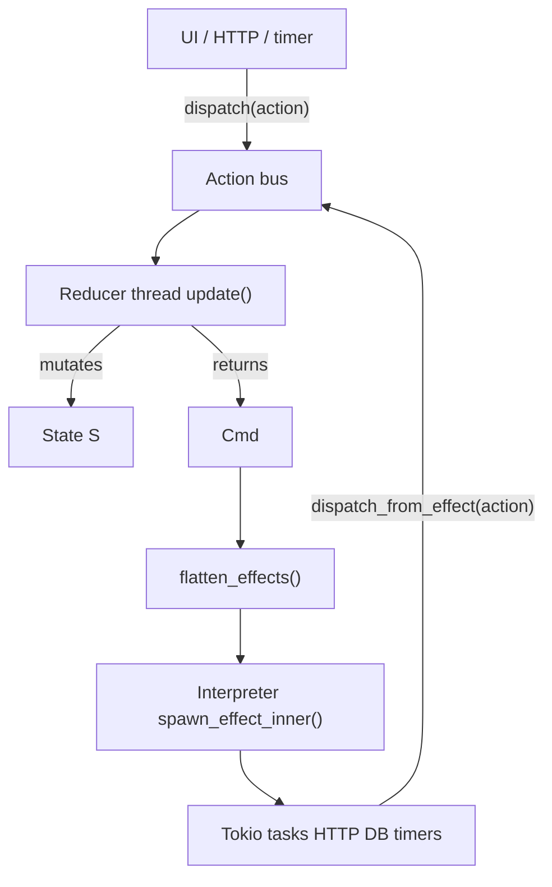
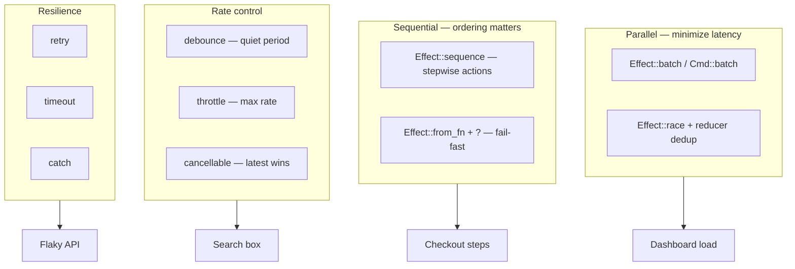

# Effects — architecture, theory, and everyday patterns

Effects are **descriptions of async work**, not the work itself. Your reducer stays pure: it returns a `Cmd<Action>` that *says* what to run. The runtime **interprets** those descriptions on Tokio and sends resulting actions back through the bus.

Source: [`src/core/effect.rs`](../src/core/effect.rs) · Interpreter: [`src/runtime/interpreter.rs`](../src/runtime/interpreter.rs)

See also: [cmd.md](./cmd.md) (the `Cmd` wrapper reducers return), [sub.md](./sub.md) (long-lived subscriptions vs one-shot effects), [architecture.md](./architecture.md) (threading model), [`tests/effect_integration.rs`](../tests/effect_integration.rs) (debounce, cancel, throttle).

---

## The big picture

In mainstream async Rust you often mix state updates and I/O inside handlers:

```rust
// imperative style — hard to test, easy to race
async fn on_click(state: &mut App, client: &HttpClient) {
    state.loading = true;
    let user = client.get("/user").await?;
    state.user = user;
}
```

In rust-elm, the reducer **never awaits**. It returns data describing side effects:

```rust
fn update(state: &mut App, msg: Action) -> Cmd<Action> {
    match msg {
        Action::LoadUser => {
            state.loading = true;
            Cmd::single(Effect::from_fn(|| Box::pin(async {
                let user = fetch_user().await?;
                Ok(Action::UserLoaded(user))
            })))
        }
        Action::UserLoaded(user) => {
            state.loading = false;
            state.user = Some(user);
            Cmd::none()
        }
    }
}
```

This split comes from **The Elm Architecture (TEA)** and is sometimes called **Functional Core, Imperative Shell**:

| Layer | Responsibility | Runs where |
|-------|----------------|------------|
| **Reducer** (`update`) | Pure state transition + *what* to run | Single reducer thread |
| **`Effect<M>`** | Serializable/async-work blueprint | Built on reducer thread |
| **Interpreter** | Spawns Tokio tasks, dispatches `M` | Tokio thread pool |
| **Bus** | Serializes actions into reducer | Channel between threads |



**Critical rule:** reducer actions are always **serial** (one at a time). Effect **siblings** are **parallel** unless wrapped in `Effect::Sequence`.

---

## From `Cmd` to running tasks

```rust
pub enum Cmd<M> {
    None,
    Single(Effect<M>),
    Batch(Vec<Cmd<M>>),
}
```

`Cmd::into_effects()` collects all effects from a command tree. The interpreter then calls `flatten_effects` on each top-level effect:

```rust
// flatten_effects only expands Effect::Batch — not Sequence, Debounce, etc.
Effect::Batch(items) => items.into_iter().flat_map(flatten_effects).collect(),
other => vec![other],
```

Each **flattened leaf** that is a bare `Task` / `RegisteredTask` / … gets its **own Tokio task**. Combinators like `Sequence`, `Debounce`, `Retry` stay as **one interpreter node** (one outer task or timer).

| What you return | What runs in parallel |
|-----------------|----------------------|
| `Cmd::batch([cmd_a, cmd_b])` | `cmd_a` and `cmd_b` leaves — **parallel** |
| `Effect::batch([e1, e2, e3])` | All three children — **parallel** |
| `Effect::sequence([e1, e2, e3])` | **One** task runs e1 → e2 → e3 in order |
| `Effect::debounce(...)` | Timer + inner; not flattened away |

---

## Leaf effects — doing one piece of work

### `Effect::None`

No work. Use when the reducer only mutates state.

### `Effect::task(id, run)` / `Effect::from_fn(closure)`

**Theory:** A single async computation that produces **one action** (`Ok(M)`) or an `EffectError`.

- `task` uses a **function pointer** (`TaskFn<M>`) — good for named, reusable tasks and stable IDs for cancellation.
- `from_fn` **registers** a closure in a global registry and returns `RegisteredTask` — ergonomic for one-off work in reducers.

**Daily life:** HTTP GET, DB query, read a file, parse JSON, sleep.

```rust
Cmd::single(Effect::from_fn(|| Box::pin(async move {
    let body = reqwest::get(URL).await?.text().await?;
    Ok(Action::HtmlLoaded(body))
})))
```

**Cancellation:** Tasks registered with `Effect::task(id, …)` store an `AbortHandle` under `id`. `Effect::cancel(id)` aborts the in-flight task.

### `Effect::env_task` / `Effect::from_env_fn`

Same as `task`, but receives `&Environment` — the app's **dependency injection** container (`HttpDep`, `DateDep`, DB pools, config).

**Daily life:** Any I/O that needs shared clients without threading globals.

See `env_probe_effect()` in [`examples/ecommerce/shop.rs`](../examples/ecommerce/shop.rs).

### `Effect::from_run` + `RunSender<M>`

**Theory:** A long-running or multi-step process that may emit **many actions** before finishing (UDF `.run { send in … }`).

```rust
Cmd::single(Effect::from_run(|send: RunSender<Action>| {
    Box::pin(async move {
        send.send(Action::Progress(0));
        do_chunk().await;
        send.send(Action::Progress(50));
        do_chunk().await;
        send.send(Action::Done);
        Ok(())
    })
}))
```

**Daily life:** File upload progress, WebSocket fan-in, polling loop that reports each tick, batching DB writes with per-row confirmations.

### `Effect::result_task`

Maps `Result<T, E>` from the async body into your action type via **function pointers** (no closure in the action enum):

```rust
Effect::result_task(fetch_user_raw, Action::UserOk, Action::UserErr)
```

**Daily life:** When your HTTP layer returns `Result` and you want typed success/failure actions without nested `match` inside the async block.

---

## Combinators — orchestrating many effects

### `Effect::batch` / `Effect::merge`

**Theory:** **Concurrent** execution — each child is spawned independently. All successful children dispatch their actions (order not guaranteed).

**Real life — dashboard with three APIs in parallel:**

You need user profile, cart, and notifications **at the same time**, then combine them.

#### Pattern A — parallel effects + reducer “join” (idiomatic TEA)

Fire three effects; reducer collects partial results until all slots are filled:

```rust
#[derive(Default)]
struct DashboardState {
    user: Option<User>,
    cart: Option<Cart>,
    notifications: Option<Vec<Notif>>,
    ready: bool,
}

enum Action {
    LoadDashboard,
    UserLoaded(User),
    CartLoaded(Cart),
    NotifsLoaded(Vec<Notif>),
}

fn update(state: &mut DashboardState, msg: Action) -> Cmd<Action> {
    match msg {
        Action::LoadDashboard => {
            state.user = None;
            state.cart = None;
            state.notifications = None;
            state.ready = false;
            Cmd::single(Effect::batch([
                Effect::from_fn(|| Box::pin(async { Ok(Action::UserLoaded(fetch_user().await?)) })),
                Effect::from_fn(|| Box::pin(async { Ok(Action::CartLoaded(fetch_cart().await?)) })),
                Effect::from_fn(|| Box::pin(async { Ok(Action::NotifsLoaded(fetch_notifs().await?)) })),
            ]))
        }
        Action::UserLoaded(u) => {
            state.user = Some(u);
            maybe_finish_dashboard(state)
        }
        Action::CartLoaded(c) => {
            state.cart = Some(c);
            maybe_finish_dashboard(state)
        }
        Action::NotifsLoaded(n) => {
            state.notifications = Some(n);
            maybe_finish_dashboard(state)
        }
    }
}

fn maybe_finish_dashboard(state: &mut DashboardState) -> Cmd<Action> {
    if let (Some(user), Some(cart), Some(notifs)) =
        (&state.user, &state.cart, &state.notifications)
    {
        if !state.ready {
            state.ready = true;
            // All three done — further work: analytics, render flag, next fetch, etc.
            build_dashboard_view(user, cart, notifs);
        }
    }
    Cmd::none()
}
```

**Why this pattern:** Each API failure can map to its own action (`UserFailed`, …). Partial UI can render as data arrives. Fully testable with `TestStore` by sending actions in any order.

#### Pattern B — single task with `tokio::join!` (imperative shell inside one effect)

When you want **one** action only after **all** succeed, and failures should fail the whole operation:

```rust
Cmd::single(Effect::from_fn(|| Box::pin(async move {
    let (user, cart, notifs) = tokio::join!(
        fetch_user(),
        fetch_cart(),
        fetch_notifs(),
    );
    let user = user?;
    let cart = cart?;
    let notifs = notifs?;
    Ok(Action::DashboardReady { user, cart, notifs })
})))
```

**Trade-off:** Simpler “all or nothing”, but one error type, no incremental UI, harder to cancel individual legs unless you wrap joins manually.

Equivalent top-level shape:

```rust
Cmd::batch([
    Cmd::single(Effect::from_fn(/* user */)),
    Cmd::single(Effect::from_fn(/* cart */)),
    Cmd::single(Effect::from_fn(/* notifs */)),
])
// same parallelism as Effect::batch
```

---

### `Effect::sequence` / `Effect::concatenate`

**Theory:** **Sequential** execution inside **one** Tokio task. Child *i+1* starts after child *i* completes.

**Real life — checkout pipeline:**

1. Validate cart  
2. Create payment intent  
3. Confirm order  

```rust
Cmd::single(Effect::sequence([
    Effect::from_fn(|| Box::pin(async { Ok(Action::Validated) })),
    Effect::from_fn(|| Box::pin(async { Ok(Action::PaymentCreated(id)) })),
    Effect::from_fn(|| Box::pin(async { Ok(Action::OrderConfirmed) })),
]))
```

#### Sequential with “stop if one fails”

**Important runtime behavior:** On `Err`, `Sequence` **skips dispatching** that step but **continues** to the next child. It does **not** abort the chain.

```rust
// interpreter.rs — simplified
for item in items {
    if let Ok(msg) = run_effect_once(item, env.clone()).await {
        dispatch_from_effect(&backend, &tx, msg);
    }
    // Err: silently continue to next item
}
```

For **true fail-fast** (stop the pipeline, surface error action), use **one** `from_fn` and `?`:

```rust
Cmd::single(Effect::from_fn(|| Box::pin(async move {
    let cart = validate_cart().await?;           // stops here on Err
    let payment = create_payment(&cart).await?;
    let order = confirm_order(payment).await?;
    Ok(Action::CheckoutComplete(order))
})))
```

Or wrap with `Effect::catch` / `Effect::result_task` to turn failures into actions.

**Real life — onboarding wizard:** Step 1 create account → Step 2 upload avatar → Step 3 send welcome email. Use `sequence` when each step should dispatch an action and update UI between steps. Use single `from_fn` when the user sees one spinner and one outcome.

---

### `Effect::race`

**Theory (general FP):** Run competitors in parallel; **first success wins**; cancel losers.

**Current rust-elm behavior:** `Race` and `Batch` share the **same interpreter branch** — all children spawn in parallel; **each success dispatches its action**. There is no automatic cancellation of slower siblings.

**Real life — mirror / CDN / fallback endpoint:**

You call primary and backup APIs; whichever responds first drives the UI **if you handle it in the reducer**:

```rust
struct State {
    search_result: Option<String>,
    search_generation: u64,
}

enum Action {
    Search { query: String, gen: u64 },
    SearchResult { gen: u64, text: String },
}

fn update(state: &mut State, msg: Action) -> Cmd<Action> {
    match msg {
        Action::Search { query, gen } => {
            state.search_generation = gen;
            Cmd::single(Effect::race([
                Effect::from_fn(move || Box::pin(async move {
                    Ok(Action::SearchResult { gen, text: search_primary(&query).await? })
                })),
                Effect::from_fn(move || Box::pin(async move {
                    Ok(Action::SearchResult { gen, text: search_backup(&query).await? })
                })),
            ]))
        }
        Action::SearchResult { gen, text } => {
            // Ignore stale or slower responses
            if gen == state.search_generation {
                state.search_result = Some(text);
            }
            Cmd::none()
        }
    }
}
```

Pair with `Effect::cancellable` or generation counters — same pattern as autocomplete and typeahead.

**When to prefer `race` over `batch`:** Same runtime today; choose `race` to document intent (“first useful response matters”) and to pair with reducer-side deduplication.

---

### `Effect::cancellable` / `Effect::cancel`

**Theory:** **Supersession** — new work replaces old work with the same `EffectId`.

- `Effect::cancellable(id, inner)` — before starting `inner`, abort prior task registered under `id` (`cancel_in_flight: true`).
- `Effect::cancel(id)` — abort only; dispatch nothing.

**Real life:**

| Scenario | Technique |
|----------|-----------|
| User types in search box | `cancellable` + `debounce` |
| Navigate away from page | `Effect::cancel(FETCH_ID)` on route change |
| Switch product detail SKU | cancel previous detail fetch |
| `IfLetReducer` dismisses modal | scope emits cancel for child effects |

```rust
// Rapid SKU changes — only latest fetch may finish
Cmd::single(Effect::cancellable(
    DETAIL_FETCH_ID,
    Effect::from_fn(move || Box::pin(async move {
        Ok(Action::DetailLoaded(fetch(sku).await?))
    })),
))
```

See [`tests/effect_integration.rs`](../tests/effect_integration.rs) — `cancel_effect_aborts_in_flight_task`, `cancellable_cancel_in_flight_replaces_previous`.

---

### `Effect::debounce`

**Theory:** Wait for **quiet period** (`duration`) after the last trigger; only then run `inner`. Each new trigger **resets** the timer (trailing edge).

**Real life:** Search-as-you-type, resize handler, “save draft” after user stops typing, map bounds changed.

```rust
Action::QueryChanged(q) => Cmd::single(Effect::debounce(
    SEARCH_ID,
    Duration::from_millis(300),
    Effect::from_fn(move || Box::pin(async move {
        Ok(Action::SearchResults(fetch(&q).await?))
    })),
)),
```

If the user types `"rust"` quickly, you get **one** fetch for the final query, not four.

---

### `Effect::throttle`

**Theory:** At most **one execution per window**. Two modes via `latest`:

| `latest` | Behavior | Real life |
|----------|----------|-----------|
| `false` | **Leading edge** — first event in window runs; rest ignored until window ends | Rate-limit analytics beacons, “click once per second” |
| `true` | **Trailing edge** — events coalesce; run **last** pending when window opens | Scroll position sync, live cursor broadcast |

```rust
// Scroll: send latest position at most every 100ms
Effect::throttle(SCROLL_ID, Duration::from_millis(100), true, inner)

// Button: first click only per 500ms
Effect::throttle(CLICK_ID, Duration::from_millis(500), false, inner)
```

---

### `Effect::retry`

**Theory:** Re-run `inner` up to `attempts` times until **first success**. Failures do not dispatch; if all attempts fail, **nothing** is dispatched (silent exhaustion).

**Real life:** Flaky network, optimistic locking conflicts, idempotent POST.

```rust
Cmd::single(Effect::retry(3, Effect::from_fn(|| Box::pin(async {
    Ok(Action::Saved(upload().await?))
}))))
```

Combine with `catch` or `result_task` if you need `Action::SaveFailed` when retries exhaust.

---

### `Effect::timeout`

**Theory:** Run `inner` with a wall-clock bound. On timeout, the effect completes with **no action** (silent drop).

**Real life:** “Loading…” spinner must not hang forever; SLA on third-party API.

```rust
Effect::timeout(
    Duration::from_secs(5),
    Effect::from_fn(|| Box::pin(async { Ok(Action::Loaded(fetch().await?)) })),
)
```

For `Action::TimedOut` UI, prefer explicit handling inside `from_fn` with `tokio::time::timeout` and map to an action.

---

### `Effect::catch`

**Theory:** Structured recovery — if `inner` fails with `EffectError`, run `recover(err)` (which can return more effects).

**Real life:** Fallback cache on network error, log and continue, switch to offline mode.

```rust
Effect::catch(
    Effect::from_fn(|| Box::pin(async { Ok(Action::Loaded(fetch_live().await?)) })),
    |err| Effect::from_fn(move || Box::pin(async move {
        Ok(Action::Loaded(load_from_cache()?))
    })),
)
```

---

### `Effect::provide` / `Effect::provide_dependency`

**Theory:** Run `inner` with an **overlaid** `Environment` (scoped DI). Used for tests and one-off overrides without changing global runtime env.

**Real life:**

```rust
// Test: inject mock HTTP client for one effect tree
Effect::provide_dependency(MockHttp(client), inner)

// Override multiple deps
Effect::provide(Environment::from_values(deps), inner)
```

---

## Error model

```rust
pub enum EffectError {
    Cancelled,
    Timeout,
    RetryExhausted,
    EnvMissing(&'static str),
    TaskFailed(&'static str),
    Other(String),
}
```

Default interpreter behavior for leaf tasks:

```rust
if let Ok(msg) = run().await {
    dispatch_from_effect(&backend, &tx, msg);
}
// Err: no dispatch — unless Catch / result_task / from_run handles it
```

| Goal | Approach |
|------|----------|
| Success/failure as actions | `Result` inside `from_fn` + `Ok(Action::Failed(…))` |
| Map `Result<T,E>` cleanly | `Effect::result_task` |
| Recover from `EffectError` | `Effect::catch` |
| Fail-fast sequential pipeline | Single `from_fn` with `?` |

---

## `Effect::map`

Transform the **output action** of an effect tree ( functorial map ). Useful when scoping child actions:

```rust
child_effect.map(ParentAction::Child)
```

`RegisteredRun` passes through unchanged (already sends via `RunSender`).

---

## Cookbook — common programming problems

### 1. Three APIs in parallel, then combine

→ **Pattern A** (batch + reducer join) or **Pattern B** (`tokio::join!` in one `from_fn`).  
See [dashboard example](#pattern-a--parallel-effects--reducer-join-idiomatic-tea) above.

### 2. Three APIs sequentially; stop on first failure

→ Single `from_fn` with `?`. Do **not** rely on `Effect::sequence` alone for fail-fast.

### 3. Try primary API, fall back to cache

→ `Effect::catch` or `result_task` with fallback action.

### 4. User typing — don’t DDoS your backend

→ `debounce` + `cancellable` on the same `EffectId`.

### 5. Poll every N seconds until done

→ `Effect::from_run` with loop + `send.send` + `tokio::time::sleep`, or subscription (`Sub`) for timer-driven actions.

### 6. Upload file with progress bar

→ `Effect::from_run` emitting `Action::Progress(n)`.

### 7. Leave page while fetch in flight

→ `Effect::cancel(FETCH_ID)` in reducer on `RouteChanged` / `IfLet` dismiss.

### 8. Parallel fetches, but only show latest search

→ `Effect::race` or `batch` + **generation counter** in reducer (ignore stale `SearchResult`).

### 9. Dependency required for effect (HTTP client)

→ `Effect::from_env_fn` + `env.require::<HttpDep>()`.

### 10. Test effect without real network

→ `TestStore` + `Effect::provide_dependency(mock, …)` or mock actions injected directly.

---

## Testing effects

`TestStore` runs effects **synchronously** on the test thread (leaf effects via `run_leaf`). Combinators:

- `Batch` / `Race` — children run in order (all complete; not true parallel in tests).
- `Sequence` — strict order.

After `dispatch`, use `receive` / `receive_timeout` to assert actions. Call `finish()` to ensure no pending effects or unconsumed actions.

Integration tests with real Tokio timing: [`tests/effect_integration.rs`](../tests/effect_integration.rs).

---

## Design cheat sheet



| Combinator | Parallel? | Fail-fast? | Dispatches on Err? |
|------------|-----------|------------|-------------------|
| `batch` / `merge` | Yes | Per leaf | No |
| `race` | Yes (same as batch) | Per leaf | No |
| `sequence` | No | **No** (continues) | No |
| `from_fn` + `?` | No | **Yes** | via your `Result` |
| `retry` | No | After N tries | No if exhausted |
| `timeout` | No | — | No on timeout |
| `catch` | No | — | Runs `recover` |
| `debounce` / `throttle` | Timer | — | Inner behavior |

---

## Mental model for Elm developers

| rust-elm | Elm / UDF |
|----------|-----------|
| `Effect::from_fn` | `Effect.fromPromise` / custom effect |
| `Effect::from_run` | `Effect.run` with `send` |
| `Effect::batch` | `Effect.batch` / merge |
| `Effect::sequence` | `Effect.concat` / sequence |
| `Effect::debounce` | Debounced commands |
| `Cmd::none()` | `Cmd.none` |

The reducer never performs IO; the interpreter is the only place that awaits. Keep **orchestration** (join, fail-fast, aggregation) either in the reducer (TEA style) or in a single effect (shell style) — both are valid; choose based on incremental UI and test granularity.
