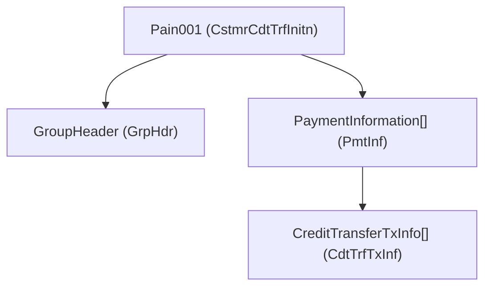
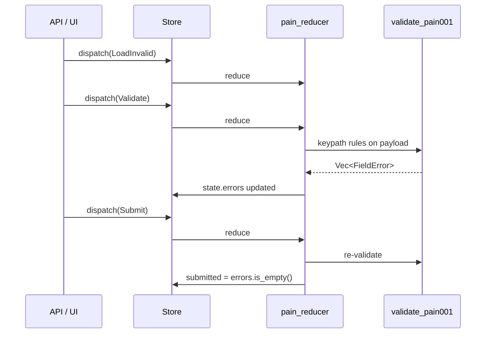

# PAIN.001 validation (ISO 20022)

This guide walks through the [`pain`](../examples/pain.rs) example: a **Customer Credit Transfer Initiation** (`pain.001.001.07`) API payload held in elm-style app state, with **reusable field validation** wired through **keypaths**.

```bash
cargo run -p rust-elm --example pain
```

For keypath-only pipelines (parallel map/filter without a store), see the root [`pain001_pipeline`](../../examples/pain001_pipeline.rs) example.

---

## Message shape

The payload mirrors ISO element paths (simplified for teaching):



| Struct | ISO block | Key fields |
|--------|-----------|------------|
| `GroupHeader` | `GrpHdr` | `MsgId`, `CreDtTm`, `NbOfTxs`, `CtrlSum`, `InitgPty/Id` |
| `PaymentInformation` | `PmtInf` | `PmtInfId`, `PmtMtd`, `ReqdExctnDt`, `Dbtr/*`, `DbtrAcct/Id` |
| `CreditTransferTxInfo` | `CdtTrfTxInf` | `PmtId/*`, `Amt/InstdAmt`, `@Ccy`, `Cdtr/*`, `CdtrAcct/Id`, `RmtInf/Ustrd` |

Structs live in [`examples/pain/model.rs`](../examples/pain/model.rs) with `#[derive(Kp)]` for generated accessors (`Pain001::group_header()`, `GroupHeader::message_id()`, …).

---

## Elm architecture



| Piece | Role |
|-------|------|
| `PainAppState` | `payload: Pain001` + `errors` + `submitted` flag |
| `PainAction` | `LoadValid`, `LoadInvalid`, `Validate`, `SetMessageId`, `Submit` |
| `pain_reducer` | Pure — calls validators, patches fields via `Writable` keypaths |
| `Runtime` | Serializes actions; no I/O required for validation |

---

## Reusable keypath validation

The framework in [`examples/pain/validation.rs`](../examples/pain/validation.rs) has three reusable, **domain-agnostic** pieces (documented in full in [validation.md](./validation.md)):

| Type | Role |
|------|------|
| `Rule<V>` | A composable check `Fn(&V) -> Option<Message>` (boxed, so it can be parameterized) |
| `Validator<R>` | Fluent accumulator over one root, prefixing every error path |
| `Validate` | Trait — `payload.validate() -> Vec<FieldError>` |

### Composable rules (combinators, not constants)

Rules are **factory functions** so they parameterize and compose, instead of fixed `fn` pointers:

```rust
rules::required()          // Rule<String>
rules::max_len(35)         // parameterized
rules::min_len(2)
rules::one_of(&["TRF"])
rules::len_in(&[8, 11])
rules::iso_currency()
rules::positive()          // Rule<f64>
rules::optional(rules::max_len(140))  // lifts Rule<V> -> Rule<Option<V>>
```

`optional(..)` is the key combinator — wrap any rule to make it pass on `None`, reuse it for every optional ISO field (`BICFI`, `RmtInf/Ustrd`).

### Fluent validator

`Validator` removes the repeated `errors.extend(...)` boilerplate. Each method returns `Self`:

```rust
Validator::new(payload)
    .field("GrpHdr/MsgId", pain_message_id(), &[rules::required(), rules::max_len(35)])
    .field("GrpHdr/CreDtTm", pain_creation_date_time(), &[rules::required(), rules::iso8601_datetime()])
    .field("GrpHdr/InitgPty/Id", pain_initiating_party_id(), &[rules::required()])
    .finish()
```

| Method | Use |
|--------|-----|
| `field(path, kp, rules)` | Validate the value reached by a keypath (records `missing` if absent) |
| `value(path, &v, rules)` | Validate a borrowed value directly (e.g. `Option<_>` fields) |
| `ensure(cond, path, msg)` | Push an error unless `cond` holds |
| `each(path, items, f)` | Validate a collection with indexed, auto-prefixed sub-validators |
| `merge(errors)` | Fold in already-prefixed errors (cross-field checks, nested results) |

### Nested collections via `each`

`each` auto-prefixes `PmtInf[i]/CdtTrfTxInf[j]/...`, so nested validators stay flat:

```rust
Validator::with_prefix(pmt, prefix)
    .field("PmtMtd", pmt_payment_method(), &[rules::required(), rules::one_of(&["TRF"])])
    .each("CdtTrfTxInf", &pmt.credit_transfer_tx_infos, validate_credit_transfer)
    .finish()
```

### Cross-field rules

Checks that span fields return `Option<FieldError>` and fold in via `merge`:

| Rule | Function |
|------|----------|
| `NbOfTxs` vs actual tx count | `validate_transaction_count` |
| `CtrlSum` vs sum of amounts | `validate_control_sum` |
| Non-empty `PmtInf` / `CdtTrfTxInf` | `ensure(..)` guards |

---

## Patching state through keypaths

`SetMessageId` demonstrates **Writable** updates without manual struct drilling:

```rust
Pain001::group_header()
    .then(GroupHeader::message_id())
    .get_mut(&mut state.payload)
    .map(|msg| *msg = id);
```

After a patch, the example clears errors and re-runs `Validate` on demand — typical form UX.

---

## Sample payloads

[`examples/pain/sample.rs`](../examples/pain/sample.rs):

| Function | Purpose |
|----------|---------|
| `sample_valid()` | 2× `PmtInf`, 3× `CdtTrfTxInf`, matching `NbOfTxs` and `CtrlSum` |
| `sample_invalid()` | Empty `MsgId`, wrong `NbOfTxs`, bad `PmtMtd`, negative amount, invalid currency |

---

## Extending validation

1. Add field to `model.rs` with `#[derive(Kp)]`.
2. Add a keypath in `keypaths.rs` (`Kp::new(get, get_mut)`).
3. Add `.field("IsoPath", kp(), &[rules::..])` to the matching `validate_*` function — reuse existing combinators or add a new one in `rules`.
4. For a cross-field invariant, write a `fn(&Pain001) -> Option<FieldError>` and `.merge(..)` it in `validate_pain001`.

Need a new reusable check? Add a combinator returning `Rule<V>` (parameterized via a closure) and it works on any struct/keypath of that value type. For HTTP ingress, dispatch `LoadFromJson` from an effect and return `Validate` — keep validation pure in the reducer.

---

## Related files

| File | Role |
|------|------|
| [`examples/pain.rs`](../examples/pain.rs) | Elm store + demo scenario |
| [`examples/pain/model.rs`](../examples/pain/model.rs) | ISO 20022 structs + `Kp` |
| [`examples/pain/keypaths.rs`](../examples/pain/keypaths.rs) | Reusable fn-pointer `KpType` paths |
| [`examples/pain/validation.rs`](../examples/pain/validation.rs) | Reusable keypath validators |
| [`examples/pain/sample.rs`](../examples/pain/sample.rs) | Valid / invalid fixtures |
| [`examples/pain001_pipeline.rs`](../../examples/pain001_pipeline.rs) | KpType parallel pipeline (no elm) |
