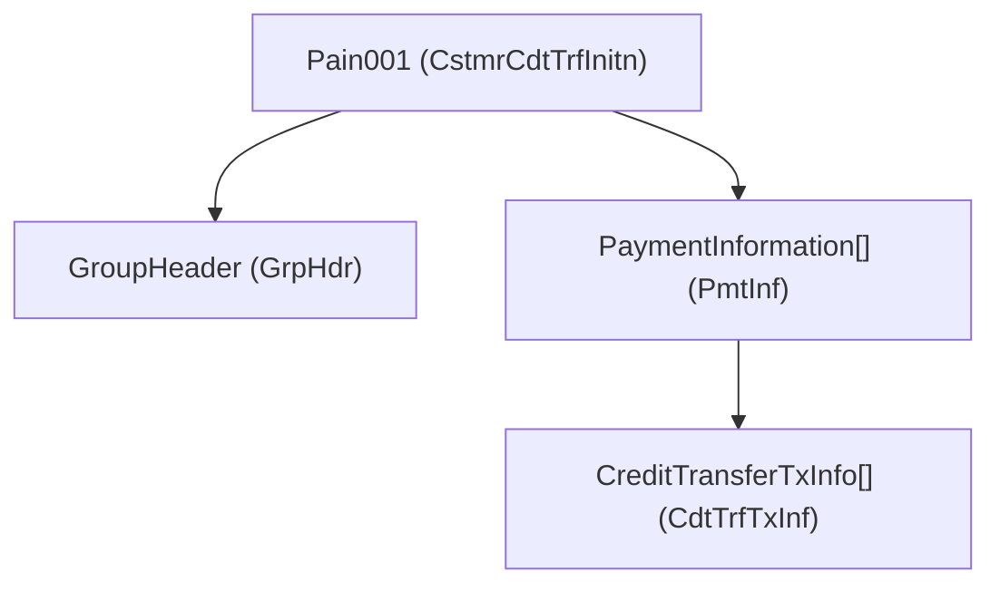
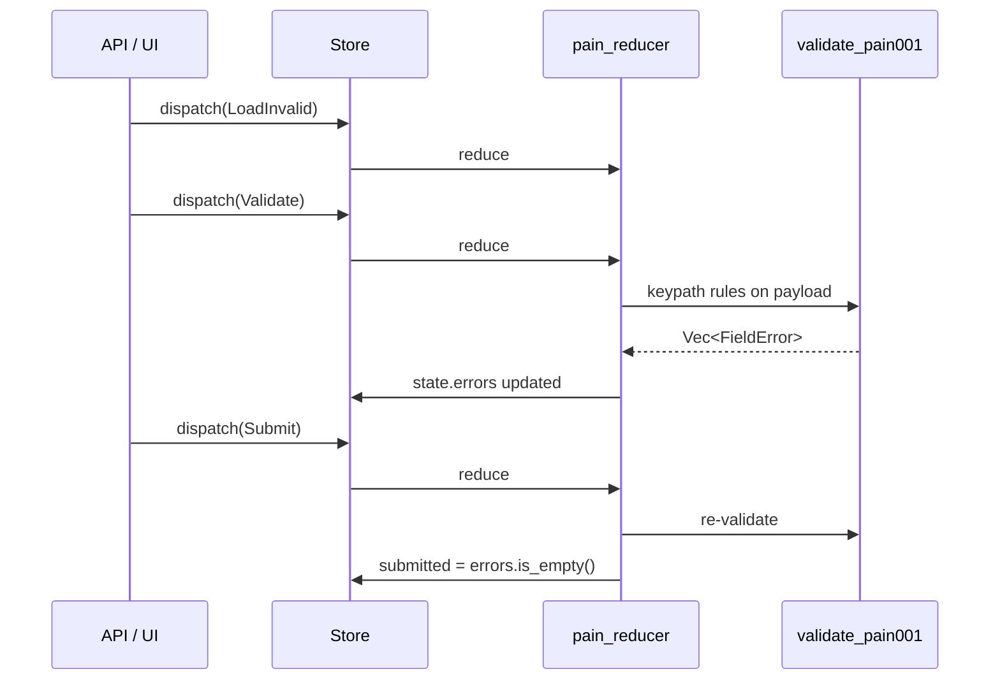

# PAIN.001 validation (ISO 20022)

This guide walks through the [`pain`](../examples/pain.rs) example: a **Customer Credit Transfer Initiation** (`pain.001.001.07`) API payload held in elm-style app state, with **reusable field validation** wired through **keypaths**.

```bash
cargo run -p rust-elm --example pain
```

For keypath-only pipelines (parallel map/filter without a store), see the root [`pain001_pipeline`](../../examples/pain001_pipeline.rs) example.

---

## Message shape

The payload mirrors ISO element paths (simplified for teaching):



| Struct | ISO block | Key fields |
|--------|-----------|------------|
| `GroupHeader` | `GrpHdr` | `MsgId`, `CreDtTm`, `NbOfTxs`, `CtrlSum`, `InitgPty/Id` |
| `PaymentInformation` | `PmtInf` | `PmtInfId`, `PmtMtd`, `ReqdExctnDt`, `Dbtr/*`, `DbtrAcct/Id` |
| `CreditTransferTxInfo` | `CdtTrfTxInf` | `PmtId/*`, `Amt/InstdAmt`, `@Ccy`, `Cdtr/*`, `CdtrAcct/Id`, `RmtInf/Ustrd` |

Structs live in [`examples/pain/model.rs`](../examples/pain/model.rs) with `#[derive(Kp)]` for generated accessors (`Pain001::group_header()`, `GroupHeader::message_id()`, …).

---

## Elm architecture



| Piece | Role |
|-------|------|
| `PainAppState` | `payload: Pain001` + `errors` + `submitted` flag |
| `PainAction` | `LoadValid`, `LoadInvalid`, `Validate`, `SetMessageId`, `Submit` |
| `pain_reducer` | Pure — calls validators, patches fields via `Writable` keypaths |
| `Runtime` | Serializes actions; no I/O required for validation |

---

## Reusable keypath validation

Core helper in [`examples/pain/validation.rs`](../examples/pain/validation.rs):

```rust
pub fn validate_at<Root, V>(
    root: &Root,
    iso_path: &str,
    kp: KpType<'static, Root, V>,
    rules: &[Rule<V>],
) -> Vec<FieldError>
```

- **`iso_path`** — error label matching ISO (e.g. `"GrpHdr/MsgId"`)
- **`kp`** — any `KpType` or composed chain (`.then()`)
- **`rules`** — slice of pure `fn(&V) -> Option<&'static str>`

### Composed keypath example

Fn-pointer keypaths in [`keypaths.rs`](../examples/pain/keypaths.rs) compose with `validate_at`:

```rust
validate_at(
    payload,
    "GrpHdr/MsgId",
    pain_message_id(),
    rules::MSG_ID,
);
```

Use `Kp::new(get, get_mut)` for nested paths so validators share one `KpType` type (required by `validate_at`). Derived `#[derive(Kp)]` accessors work for direct fields on leaf structs.

Rule sets are shared constants:

```rust
pub const MSG_ID: &[Rule<String>] = &[required_string, max_len_35];
pub const CURRENCY: &[Rule<String>] = &[required_string, iso_currency];
pub const AMOUNT: &[Rule<f64>] = &[positive_amount];
```

The same `rules::CURRENCY` applies whether you validate from `Pain001` root or a nested `CreditTransferTxInfo` via `CreditTransferTxInfo::currency()`.

### Cross-field rules

Some checks are not single-field keypaths:

| Rule | Function |
|------|----------|
| `NbOfTxs` vs actual tx count | `validate_transaction_count` |
| `CtrlSum` vs sum of amounts | `validate_control_sum` |
| Non-empty `PmtInf` / `CdtTrfTxInf` | collection guards in `validate_pain001` |

---

## Patching state through keypaths

`SetMessageId` demonstrates **Writable** updates without manual struct drilling:

```rust
Pain001::group_header()
    .then(GroupHeader::message_id())
    .get_mut(&mut state.payload)
    .map(|msg| *msg = id);
```

After a patch, the example clears errors and re-runs `Validate` on demand — typical form UX.

---

## Sample payloads

[`examples/pain/sample.rs`](../examples/pain/sample.rs):

| Function | Purpose |
|----------|---------|
| `sample_valid()` | 2× `PmtInf`, 3× `CdtTrfTxInf`, matching `NbOfTxs` and `CtrlSum` |
| `sample_invalid()` | Empty `MsgId`, wrong `NbOfTxs`, bad `PmtMtd`, negative amount, invalid currency |

---

## Extending validation

1. Add field to `model.rs` with `#[derive(Kp)]`.
2. Add rule fn + const slice in `validation::rules`.
3. Call `validate_at` from the appropriate `validate_*` function with ISO path label.
4. For new cross-field invariant, add a `validate_*` helper and call it from `validate_pain001`.

For HTTP ingress, dispatch `PainAction::LoadFromJson` from an effect and return `PainAction::Validate` — keep validation pure in the reducer.

---

## Related files

| File | Role |
|------|------|
| [`examples/pain.rs`](../examples/pain.rs) | Elm store + demo scenario |
| [`examples/pain/model.rs`](../examples/pain/model.rs) | ISO 20022 structs + `Kp` |
| [`examples/pain/keypaths.rs`](../examples/pain/keypaths.rs) | Reusable fn-pointer `KpType` paths |
| [`examples/pain/validation.rs`](../examples/pain/validation.rs) | Reusable keypath validators |
| [`examples/pain/sample.rs`](../examples/pain/sample.rs) | Valid / invalid fixtures |
| [`examples/pain001_pipeline.rs`](../../examples/pain001_pipeline.rs) | KpType parallel pipeline (no elm) |
