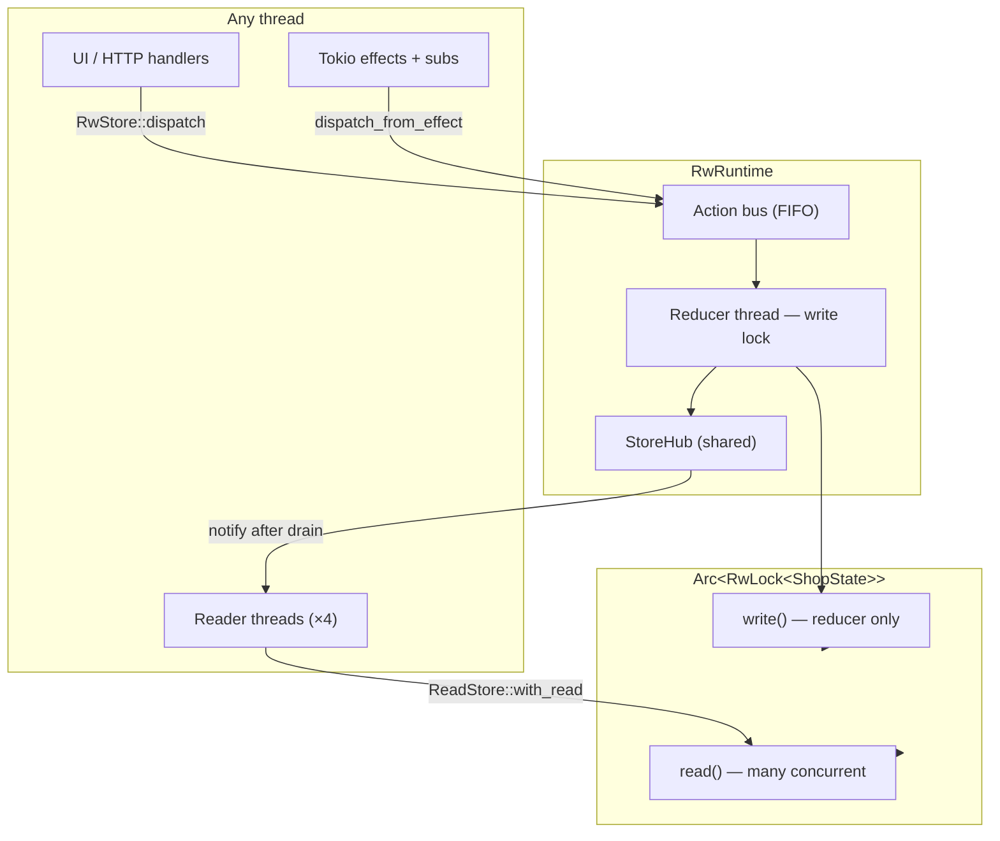
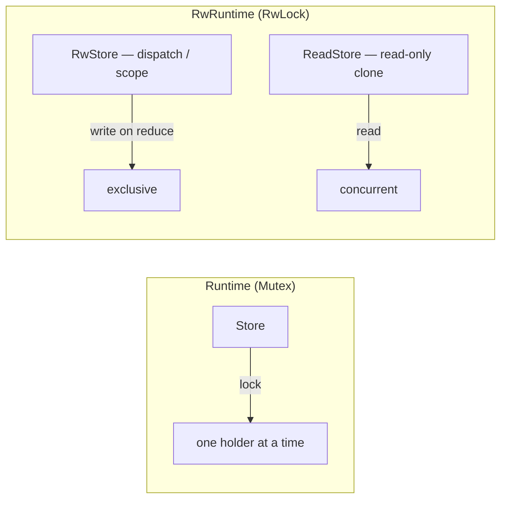
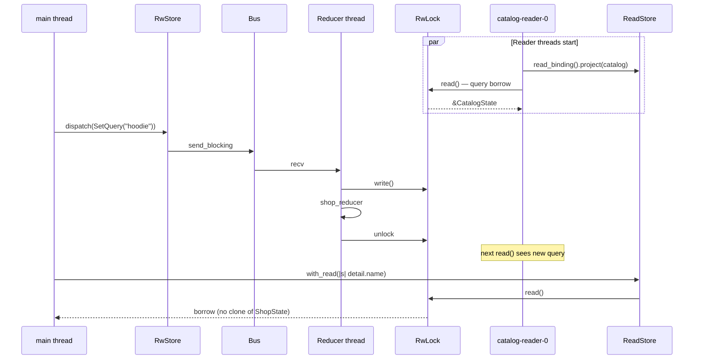
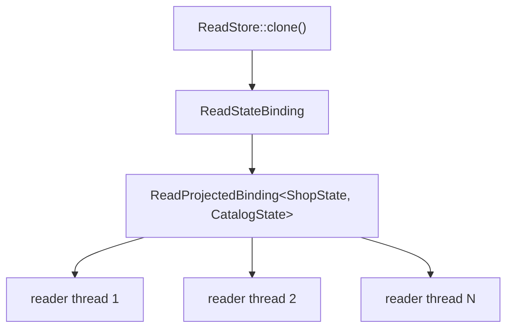

# Rw ecommerce example — read-heavy store architecture

Companion to [`examples/rw_ecommerce.rs`](../examples/rw_ecommerce.rs). Same shop domain as [ecommerce.md](./ecommerce.md); this document focuses on **`RwRuntime`**, **`ReadStore`**, and **`RwStore`**.

Run it:

```bash
cargo run -p rust-elm --example rw_ecommerce
```

For reducer composition, subscriptions, and DI, see [ecommerce.md](./ecommerce.md). For mutex stores and `subscribe_changes`, see [store.md](./store.md) and [binding.md](./binding.md).

---

## What this example adds

| Feature | Where |
|---------|--------|
| `RwRuntime` | `Arc<RwLock<ShopState>>` + same bus / Tokio stack as `Runtime` |
| `ReadStore` | Concurrent readers via `with_read` / `read_binding` |
| `RwStore` | Dispatch, `send`, `scope`, subscriptions |
| `ScopedRwStore` | Cart child dispatch (`cart_scope`) |
| Concurrent reader threads | `spawn_catalog_readers` — 4 threads, zero-copy `ReadProjectedBinding` |
| Shared shop logic | [`examples/ecommerce/shop.rs`](../examples/ecommerce/shop.rs) |

The mutex [`ecommerce`](../examples/ecommerce.rs) example keeps panic demos and `subscribe_state` snapshots. This example omits those and highlights **read-heavy** access patterns instead.

---

## High-level architecture



**Single writer, many readers:** the reducer thread holds `write()` for the duration of `reduce`. Reader threads hold `read()` for short borrows. Writers block readers; readers do not block each other.

---

## Store handles compared



| Handle | Lock | Use when |
|--------|------|----------|
| `Store` (mutex) | `Mutex` | Simple default; reduce + read serialize |
| `RwStore` | `write()` on reduce; `read()` for `state()` snapshot | Dispatch, cancel, scoped child writes |
| `ReadStore` | `read()` only | Analytics, UI renderers, many parallel readers |
| `ReadStateBinding` | `read()` per `with_read` | Zero-copy field access without cloning `ShopState` |
| `RwStateBinding` | `read()` / `write()` | Local UI that mutates through keypaths (advanced) |

---

## Threading model (shop scenario)



`StoreHub` (listeners, effect-done queue, in-flight counter) is **shared** between mutex and Rw backends — only the state lock type changes.

---

## Reader worker pattern (from the example)

```rust
let read_store = runtime.read_store();
let binding = read_store
    .read_binding()
    .project(ShopState::catalog());

// Many threads can call this concurrently:
if let Some(q) = binding.with_read(|c| c.query.clone()) {
    // only clone the small field, not ShopState
}
```



Clone `ReadStore` onto each reader thread — cheap `Arc` clones of `RwLock` + `StoreHub`.

---

## When to choose Rw vs Mutex

| Scenario | Recommendation |
|----------|----------------|
| Single UI thread + occasional `state()` | `Runtime` / `Store` — simpler |
| Many threads reading catalog/cart while reducer runs | `RwRuntime` + `ReadStore` |
| Hot path needs zero-copy field reads | `read_binding()` + keypaths |
| Write-heavy, few readers | Mutex is fine (less RwLock writer overhead) |
| Huge state, frequent full snapshots | Avoid `state()` on both; prefer bindings / `subscribe_changes` |

RwLock helps when **read contention** on `Mutex` would serialize unrelated readers. Reduce throughput is still **one action at a time** on the reducer thread.

---

## Scoped dispatch on RwStore

```rust
let cart_scope = rw_store.scope(cart_lens(), ShopAction::cart_cp());
cart_scope.dispatch(CartAction::Line(0, CartLineAction::Inc));
```

Same optics as `ScopedStore`; child actions lift to `ShopAction` on the bus. Subscriptions and effects use the shared `StoreHub` — see [ecommerce.md](./ecommerce.md#subscriptions-in-a-child-scope).

---

## Related files

| File | Role |
|------|------|
| [`examples/rw_ecommerce.rs`](../examples/rw_ecommerce.rs) | RwRuntime demo + concurrent readers |
| [`examples/ecommerce.rs`](../examples/ecommerce.rs) | Mutex runtime + panic / subscription demos |
| [`examples/ecommerce/shop.rs`](../examples/ecommerce/shop.rs) | Shared state, reducers, subscriptions |
| [`examples/ecommerce/deps.rs`](../examples/ecommerce/deps.rs) | HTTP + date + WebSocket DI |
| [`src/runtime/rw_engine.rs`](../src/runtime/rw_engine.rs) | `RwRuntime` bootstrap |
| [`src/runtime/rw_store.rs`](../src/runtime/rw_store.rs) | `RwStore`, `ReadStore`, subscribers |
| [`ecommerce.md`](./ecommerce.md) | Full shop composition guide |
