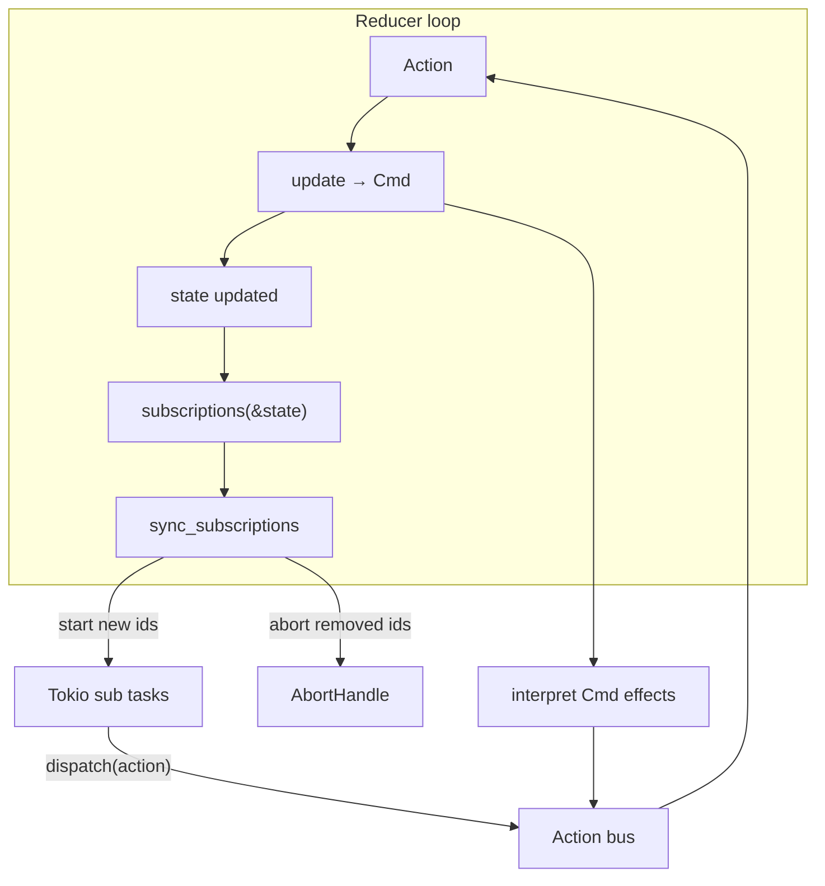
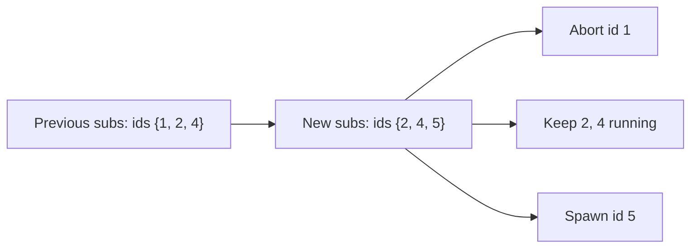
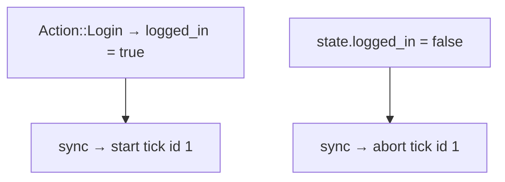

# Subscriptions (`Sub`) — architecture, theory, and everyday patterns

Subscriptions describe **long-lived input sources** driven by **current state**: timers, streams, WebSockets. Unlike `Cmd` (one-shot effects after an action), `Sub` is recomputed after **every** reduce and reconciled with what is already running.

Source: [`src/core/sub.rs`](../src/core/sub.rs) · Interpreter: [`src/runtime/subscription/mod.rs`](../src/runtime/subscription/mod.rs) · Companion: [cmd.md](./cmd.md), [effects.md](./effects.md)

---

## The big picture

Elm programs have three pillars:

```rust
Program::new(init, update, subscriptions)
//           ^      ^       ^
//           |      |       └── what listeners should be active *now*
//           |      └── state transition + one-shot Cmd
//           └── initial state + startup Cmd
```

| Mechanism | Trigger | Lifetime | Typical use |
|-----------|---------|----------|-------------|
| **`Cmd` / `Effect`** | Returned from `update` (or `init`) | One-shot (or combinator-defined) | HTTP fetch, save file, debounced search |
| **`Sub`** | Declared by `subscriptions(&state)` | Long-lived until state says stop | Clock ticks, live streams, WebSocket feeds |
| **UI events** | External `dispatch(action)` | Per event | Button clicks, form input |



**Mental model:** `Cmd` answers “do this **once** because of that action.” `Sub` answers “keep listening **while** state looks like this.”

---

## The `Sub` type

```rust
pub enum Sub<M> {
    None,
    Tick { id, every, produce: fn() -> M },
    Stream { id, name, every, produce: fn() -> M },
    WebSocket { id, url, every, produce: fn() -> M },
    MapMsg { inner: Box<Sub<()>>, map: fn(()) -> M },
    Batch(Vec<Sub<M>>),
}
```

Constructors:

```rust
Sub::none()
Sub::tick(id, every, produce)
Sub::stream(id, name, every, produce)
Sub::websocket(id, url, every, produce)
Sub::map_msg(inner: Sub<()>, map: fn(()) -> M)
Sub::batch([sub_a, sub_b, ...])
```

Every leaf subscription carries a **`u64` id**. The runtime uses ids to **start**, **keep**, or **abort** tasks — not pointer equality of the `Sub` tree.

---

## How sync works

After each successful reduce (and once at startup), the runtime calls `sync_subscriptions`:

```rust
// 1. Collect desired ids from subscriptions(&state)
collect_sub_ids(sub, &mut desired);

// 2. Abort tasks whose id is no longer desired
active.retain(|id, abort| desired.contains(id) || { abort.abort(); false });

// 3. Spawn tasks for desired ids not already running
spawn_if_new(id, active, || spawn_tick(...));
```

| Behavior | Meaning |
|----------|---------|
| **Id appears** in new `Sub` tree | Task spawned (if not already active) |
| **Id disappears** | Task **aborted** |
| **Id unchanged** | Existing task **keeps running** — not restarted |
| **`Sub::none()`** | All active subscription tasks stopped |



**Important:** Changing `every`, `url`, or `produce` for the **same id** does **not** restart the task — the old task keeps its original parameters until the id drops out and re-enters. To change interval or URL, use a **new id** or briefly remove then re-add the subscription via state.

---

## Subscription varieties

### `Sub::none()`

No listeners. Default for apps with no background input, or gated-off features.

```rust
fn subscriptions(_: &App) -> Sub<Action> {
    Sub::none()
}
```

### `Sub::tick`

**Theory:** Periodic timer — dispatches an action every `every` duration.

**Runtime detail:** Consumes the interval’s **immediate first tick** before the loop, so the **first dispatch waits one full period** (unlike `Stream`).

**Real life:**

| Scenario | Example |
|----------|---------|
| Session heartbeat | Refresh token every 5 minutes |
| Poll lightweight status | Check server health |
| Animation frame driver | Fire `Action::Frame` at 60 Hz |
| Idle timeout warning | “Still there?” prompt |

```rust
fn subscriptions(state: &App) -> Sub<Action> {
    if state.logged_in {
        Sub::tick(SESSION_TICK_ID, Duration::from_secs(30), || Action::SessionTick)
    } else {
        Sub::none()
    }
}
```

### `Sub::stream`

**Theory:** Named periodic source — same timer machinery as tick in the interpreter today, but **starts firing after the first interval without the initial skip** (`name` is for debugging/identification; not a real OS stream yet).

**Real life:**

| Scenario | Example |
|----------|---------|
| Simulated event feed | Catalog search pulse while query non-empty |
| Polling stand-in | Until a real push source exists |
| Metrics sampler | Sample queue depth every N ms |

Ecommerce example — stream active only while user is searching:

```rust
if !state.catalog.query.is_empty() {
    subs.push(Sub::stream(
        SUB_CATALOG_STREAM,
        "catalog_search",
        Duration::from_millis(150),
        sub_catalog_pulse,
    ));
}
```

### `Sub::websocket`

**Theory:** Long-lived WebSocket connection; dispatches `produce()` on each message (and on simulated ticks without the `websocket` feature).

**Features:**

- With `websocket` feature: real `tokio-tungstenite` connect, reconnect with backoff.
- Without feature: simulated loop (sleep + dispatch) — good for tests and CI.
- `mock://` URLs use simulated loop even with feature enabled.

**Real life:**

| Scenario | Example |
|----------|---------|
| Checkout status | Live order updates during checkout |
| Chat / notifications | Push messages into reducer |
| Collaborative editing | Remote patch events |
| Live sports scores | Server push |

```rust
if let Some(url) = state.session.checkout_ws_url {
    subs.push(Sub::websocket(
        SUB_CHECKOUT_WS,
        url,
        Duration::from_millis(200),  // reconnect delay
        sub_checkout_ws,
    ));
}
```

`every` on WebSocket is **reconnect/backoff timing**, not message rate.

### `Sub::map_msg`

**Theory:** Elm’s `Sub.map` — wrap a `Sub<()>` and map each firing into your action enum with a **function pointer**.

**Real life:** Reuse a unit tick in multiple features; lift pulses to parent actions without duplicating timer ids.

```rust
fn unit() {}

fn ping(_: ()) -> Action {
    Action::Ping
}

Sub::map_msg(
    Sub::tick(PING_ID, Duration::from_millis(100), unit),
    ping,
)
// produces Action::Ping every 100ms
```

Ecommerce lifts to global metric:

```rust
Sub::map_msg(
    Sub::tick(SUB_MAPMSG_UNIT, Duration::from_millis(100), sub_unit),
    sub_map_ping,  // fn(()) -> ShopAction
)
```

### `Sub::batch`

Combine independent subscriptions. Normalization matches `Cmd::batch` / `Effect::batch` (empty → `None`, singleton unwraps).

```rust
Sub::batch([
    Sub::tick(1, Duration::from_millis(100), || Action::Tick),
    Sub::map_msg(Sub::tick(2, Duration::from_millis(120), unit), ping),
])
```

All batched ids are tracked; each runs concurrently.

---

## `Sub::map` — limited utility

```rust
pub fn map<N>(self, f: fn(M) -> N) -> Sub<N>
```

Only **`Batch`** children are mapped recursively. Leaf `Tick` / `Stream` / `WebSocket` / `MapMsg` map to **`Sub::None`**.

**Prefer:**

- `produce: fn() -> Action` returning the correct variant directly, or
- `Sub::map_msg` with `Sub<()>` + embed fn.

---

## `Sub::id()`

Returns the first leaf id found (for debugging/tests). Use stable constants in production:

```rust
const SUB_SESSION_TICK: u64 = 10;
const SUB_CATALOG_STREAM: u64 = 11;
const SUB_CHECKOUT_WS: u64 = 12;
```

**Id rules:**

- **Unique** among concurrently active subs.
- **Stable** across frames when the same logical listener continues.
- **Reuse** the same id when gating off/on the same feature — sync keeps or restarts correctly.

---

## State-driven subscriptions (the idiomatic pattern)

`subscriptions` is a **pure function of state** — no I/O, no mutation:

```rust
fn subscriptions(state: &App) -> Sub<Action> {
    let mut subs = Vec::new();

    if state.logged_in {
        subs.push(Sub::tick(1, Duration::from_millis(40), || Action::Tick));
    }

    if state.checkout_open {
        subs.push(Sub::websocket(2, state.ws_url, Duration::from_secs(1), || Action::WsMsg));
    }

    Sub::batch(subs)
}
```

When `logged_in` becomes false, the next `sync_subscriptions` **aborts** tick id `1` — verified in [`tests/subscription_integration.rs`](../tests/subscription_integration.rs) (`subscriptions_stop_when_logged_out`).



### Pattern A — state-gated root subs (ecommerce)

1. Read root state in `subscriptions`.
2. Register subs only when a feature is active (`checkout.is_some()`, query non-empty).
3. Emit **root** action variants (`ShopAction::Checkout(WsPulse)`).
4. Route through `ScopeReducer` / `IfLetReducer` to child reducers.

See [ecommerce.md](./ecommerce.md) and [`examples/ecommerce/shop.rs`](../examples/ecommerce/shop.rs).

### Pattern B — global metrics via `map_msg`

Child reducer unchanged; subscription pulse maps to `GlobalAction` for cross-cutting counters.

### Pattern C — scoped dispatch vs root subs

`ScopedStore` dispatches child actions; subscriptions still typically emit **root** actions today — design subs at the program root unless you compose manually.

---

## `Sub` vs `Cmd` / `Effect` — when to use which

| Need | Use |
|------|-----|
| Fetch data **once** after button click | `Cmd::single(Effect::from_fn(...))` |
| Debounced search while typing | `Effect::debounce` in `Cmd` (not `Sub`) |
| Poll every N sec **while page open** | `Sub::tick` gated on route state |
| WebSocket **while checkout active** | `Sub::websocket` gated on `checkout.is_some()` |
| Cancel in-flight HTTP on navigation | `Effect::cancel` in `Cmd` |
| Stop background timer on logout | Remove from `subscriptions` via state gate |

**Rule of thumb:**

- **Event-driven, one-shot** → `Cmd` / `Effect`
- **State-driven, ongoing** → `Sub`

Anti-pattern: returning `Cmd::single(Effect::from_run` polling loop) when `Sub::tick` + state gating would auto-start/stop with the UI.

---

## Function pointers and `produce`

Like `Effect`, leaf subs use **`fn() -> M`** — no closures in the hot subscription description. Use named fns or thunks:

```rust
fn sub_session_tick() -> ShopAction {
    ShopAction::Global(GlobalAction::SessionTick)
}

Sub::tick(SUB_SESSION_TICK, Duration::from_millis(120), sub_session_tick)
```

For parameterized actions, encode state in the **subscription gate** (only subscribe when that SKU is selected) or dispatch a fixed action that the reducer interprets with current state.

---

## Dispatch path

Subscription firings use the same bus as effects:

```rust
dispatch_from_subscription(backend, tx, msg);
// equivalent to dispatch_from_effect today
```

Actions from subs and effects **both** serialize through the reducer thread — no concurrent reducer runs.

---

## Performance notes

`sync_subscriptions` runs **after every successful reduce**. Keep `subscriptions`:

- **Cheap** — boolean gates, field checks, small `Vec` builds.
- **Narrow** — don’t register high-frequency ticks globally if only one screen needs them.

For ingest bursts (50k dispatches), prefer `Sub::none()` or minimal subs — see [README.md](./README.md) throughput table.

Changing subscription shape allocates a new `Sub` tree each frame — acceptable for typical UI apps; avoid building huge batch trees per tick.

---

## Cookbook — everyday patterns

### 1. Simple clock

```rust
fn subscriptions(_: &App) -> Sub<Action> {
    Sub::tick(CLOCK_ID, Duration::from_secs(1), || Action::Tick)
}
```

### 2. Login-gated heartbeat

```rust
fn subscriptions(state: &App) -> Sub<Action> {
    if state.user.is_none() {
        return Sub::none();
    }
    Sub::tick(HEARTBEAT_ID, Duration::from_secs(30), || Action::Heartbeat)
}
```

### 3. Search stream while query active

```rust
fn subscriptions(state: &App) -> Sub<Action> {
    if state.query.is_empty() {
        Sub::none()
    } else {
        Sub::stream(STREAM_ID, "search", Duration::from_millis(200), || Action::SearchPulse)
    }
}
```

### 4. Checkout WebSocket only during checkout

```rust
fn subscriptions(state: &App) -> Sub<Action> {
    match (&state.checkout, state.ws_url) {
        (Some(_), Some(url)) => Sub::websocket(WS_ID, url, Duration::from_secs(1), || Action::WsEvent),
        _ => Sub::none(),
    }
}
```

### 5. Multiple concurrent listeners

```rust
fn subscriptions(state: &App) -> Sub<Action> {
    let mut subs = vec![
        Sub::map_msg(Sub::tick(PING_ID, Duration::from_secs(1), unit), ping),
    ];
    if state.flags.live {
        subs.push(Sub::tick(LIVE_ID, Duration::from_millis(50), || Action::LiveFrame));
    }
    Sub::batch(subs)
}
```

### 6. Lift unit timer to enum action

```rust
fn unit() {}
fn wrap(_: ()) -> Action { Action::Global(GlobalAction::Pulse) }

Sub::map_msg(Sub::tick(ID, dur, unit), wrap)
```

### 7. Combine with init Cmd

Startup fetch is **`init` → `Cmd`**, not `Sub`:

```rust
fn init() -> (App, Cmd<Action>) {
    (App::default(), Cmd::single(Effect::from_fn(/* boot fetch */)))
}

fn subscriptions(state: &App) -> Sub<Action> {
    if state.ready { Sub::tick(...) } else { Sub::none() }
}
```

### 8. Test subscriptions end-to-end

```rust
runtime.dispatch(Action::Login);
std::thread::sleep(Duration::from_millis(500));
assert!(runtime.state.lock().ticks >= 1);
```

See [`tests/subscription_integration.rs`](../tests/subscription_integration.rs) and [`examples/subscriptions.rs`](../examples/subscriptions.rs).

---

## Common mistakes

### Duplicated ids

Two active subs with the same id → only one task; unpredictable which spawn wins. Use distinct constants.

### Expecting param change to restart sub

Same id + changed `every` or `url` → old task continues. Drop id from tree (state off) then re-add, or use a new id.

### Using `Sub` for one-shot HTTP

Use `Cmd` + `Effect::from_fn`. Subs are for **ongoing** sources.

### Closures in `produce`

Won’t compile — use `fn() -> Action` function items.

### Heavy work in `subscriptions`

Runs every reduce — keep it O(1) / small Vec; don’t fetch network or lock for long.

### `Sub::map` on a tick

Returns `Sub::None` — use `map_msg` or typed `produce`.

### Forgetting sync is state-driven

Manually mutating state **without** going through `update` may leave stale subs until next dispatch triggers sync. Prefer `dispatch` for state transitions that affect listeners.

---

## Feature flag: `websocket`

```toml
# Cargo.toml
rust-elm = { features = ["websocket"] }
```

Without the feature, `Sub::websocket` uses a simulated timer loop — tests pass without a real server. With the feature, use `tests/support/ws_echo.rs` pattern or real URLs.

---

## Elm parity

| rust-elm | Elm |
|----------|-----|
| `Sub::none()` | `Sub.none` |
| `Sub::tick` | `Time.every` |
| `Sub::batch` | `Sub.batch` |
| `Sub::map_msg` | `Sub.map` |
| `subscriptions : Model -> Sub Msg` | same signature concept |
| `sync_subscriptions` | Elm runtime sub diff |

---

## Related reading

| Doc | Topic |
|-----|-------|
| [cmd.md](./cmd.md) | One-shot commands after `update` |
| [effects.md](./effects.md) | Debounce, cancel, async orchestration |
| [architecture.md](./architecture.md) | Threading, reducer vs Tokio |
| [ecommerce.md](./ecommerce.md) | State-gated subs in the shop |
| [store.md](./store.md) | `dispatch` and reducer loop |

**Mental model:** `Sub` is a **declarative manifest** of “what should be listening right now.” State changes the manifest; the runtime diffs by **id** and keeps the outside world in sync with your model.
