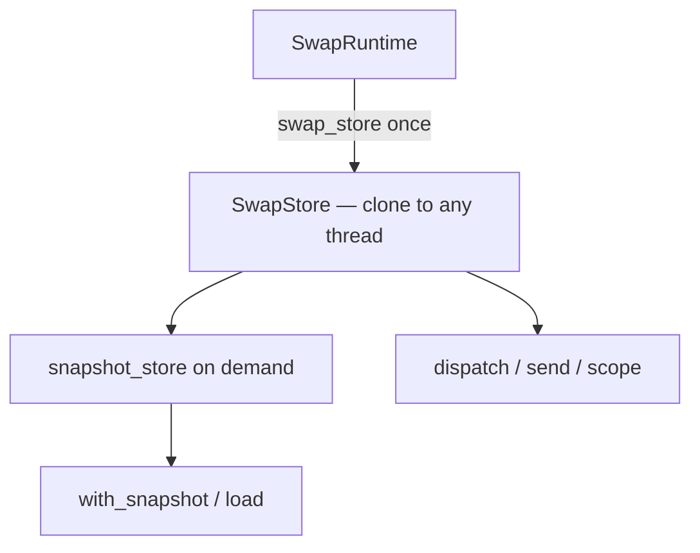
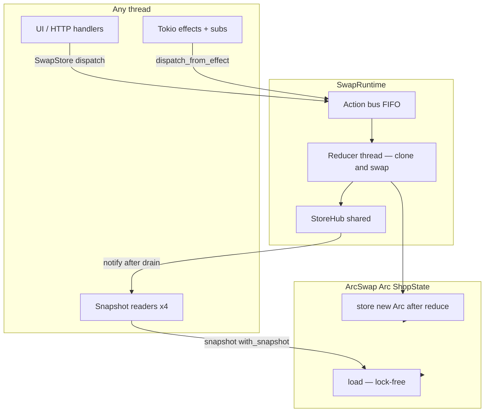
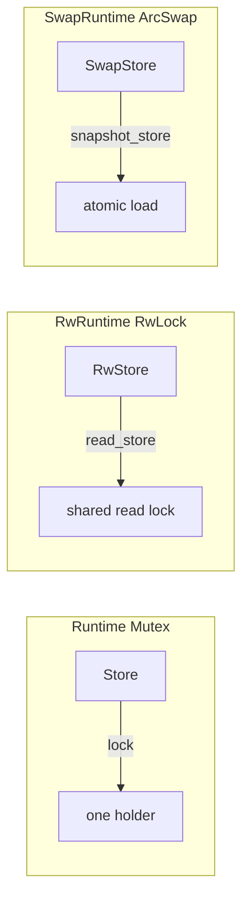
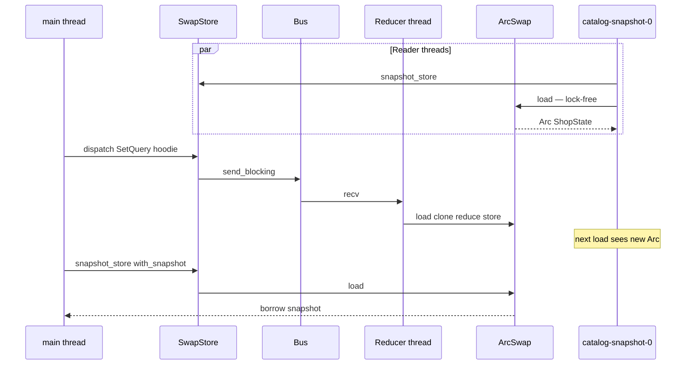

# Swap ecommerce example — lock-free snapshot architecture

Companion to [`examples/swap_ecommerce.rs`](../examples/swap_ecommerce.rs). Same shop domain as [ecommerce.md](./ecommerce.md); requires the **`arc-swap`** feature on `rust-elm`.

Run it:

```bash
cargo run -p rust-elm --example swap_ecommerce --features arc-swap
```

For reducer composition, subscriptions, and DI, see [ecommerce.md](./ecommerce.md). For store API comparison, see [store.md](./store.md) and [rw_ecommerce.md](./rw_ecommerce.md).

---

## What this example adds

| Feature | Where |
|---------|--------|
| `SwapRuntime` | `ArcSwap<ShopState>` + same bus / Tokio stack as `Runtime` |
| `SwapStore` | One cloneable handle — dispatch, `send`, `scope`, subscriptions |
| `SwapStore::snapshot_store()` | Lock-free `with_snapshot` / `load` |
| `ScopedSwapStore` | Cart child dispatch (`cart_scope`) |
| Concurrent reader threads | `spawn_catalog_readers` — `SnapshotStateBinding` per thread |
| Shared shop logic | [`examples/ecommerce/shop.rs`](../examples/ecommerce/shop.rs) |

Enable the feature in `Cargo.toml`:

```toml
rust-elm = { version = "0.7", features = ["arc-swap"] }
```

---

## One handle pattern

Hold **`SwapStore`** everywhere. Derive snapshot reads via **`snapshot_store()`**:

```rust
let store = runtime.swap_store();

// writes (reducer clones + atomic swap)
store.dispatch(ShopAction::Global(GlobalAction::SignIn(user)));
let cart = store.scope(cart_lens(), ShopAction::cart_cp());

// lock-free read
let user = store.snapshot_store().with_snapshot(|s| s.session.user.clone());

// reader threads
let snapshots = store.snapshot_store();
```



---

## High-level architecture



**Copy-on-write updates:** the reducer loads the current `Arc`, clones `ShopState`, runs `reduce`, then `store(Arc::new(next))`. Readers call `load()` without locking; they may see a slightly stale snapshot until the swap completes.

---

## Store flavors compared



| Handle | Read path | Write path | Best when |
|--------|-----------|------------|-----------|
| `Store` | `Mutex` lock | same lock | Simple default |
| `RwStore` | `read()` — many readers | `write()` on reducer | Many readers, in-place reduce |
| `SwapStore` | `load()` — lock-free | clone + atomic `store` | Read-heavy, `S: Clone` affordable |

---

## Threading model



---

## Reader worker pattern

```rust
fn spawn_catalog_readers(store: SwapStore<ShopState, ShopAction>, ...) {
    thread::spawn(move || {
        let snapshots = store.snapshot_store();
        let binding = snapshots.snapshot_binding().project(ShopState::catalog());
        loop {
            if let Some(q) = binding.with_snapshot(|c| c.query.clone()) {
                // lock-free; clones only the query string
            }
        }
    });
}
```

---

## Trade-offs vs RwLock

| | `RwStore` | `SwapStore` |
|---|-----------|-------------|
| Reader blocking | blocked by writer | never blocked |
| Writer cost | in-place mutate | full `S` clone per action |
| Stale reads | no — readers wait for write | yes — readers may lag one snapshot |
| Feature | `runtime` (default) | `arc-swap` |

Use **`SwapStore`** when read latency matters more than reduce clone cost (large fan-out of snapshot readers, analytics dashboards).

---

## Related files

| File | Role |
|------|------|
| [`examples/swap_ecommerce.rs`](../examples/swap_ecommerce.rs) | `SwapRuntime` demo + concurrent snapshot readers |
| [`examples/rw_ecommerce.rs`](../examples/rw_ecommerce.rs) | RwLock variant |
| [`examples/ecommerce/shop.rs`](../examples/ecommerce/shop.rs) | Shared reducers + subscriptions |
| [`src/runtime/swap_engine.rs`](../src/runtime/swap_engine.rs) | `SwapRuntime` bootstrap |
| [`src/runtime/swap_store.rs`](../src/runtime/swap_store.rs) | `SwapStore`, `SnapshotStore` |
| [`store.md`](./store.md) | API quick reference |
| [`ecommerce.md`](./ecommerce.md) | Full shop composition |
