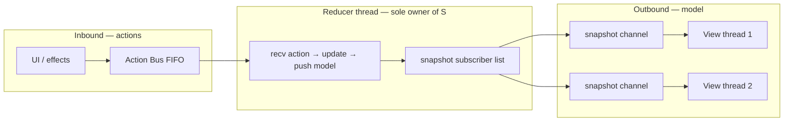
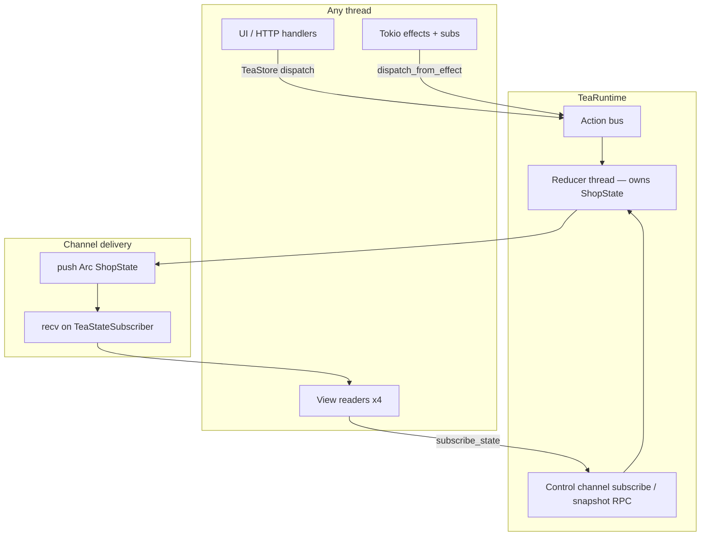
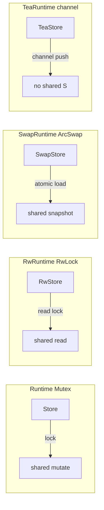
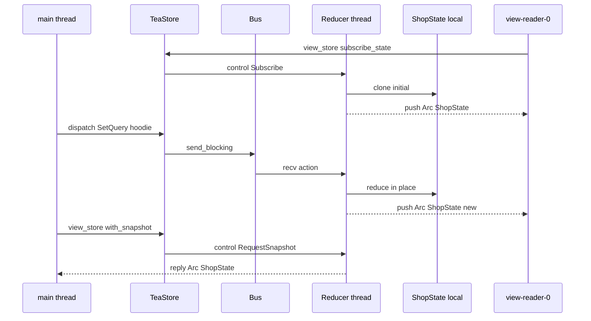

# Tea ecommerce example — channel-delivered model (true TEA)

Companion to [`examples/tea_ecommerce.rs`](../examples/tea_ecommerce.rs). Same shop domain as [ecommerce.md](./ecommerce.md); this document focuses on **`TeaRuntime`** and **channel-pushed model snapshots** — the Elm Architecture pattern where the view never reads shared mutable state.

Run it:

```bash
cargo run -p rust-elm --example tea_ecommerce
```

For reducer composition, subscriptions, and DI, see [ecommerce.md](./ecommerce.md). Compare with [swap_ecommerce.md](./swap_ecommerce.md) (atomic snapshots) and [rw_ecommerce.md](./rw_ecommerce.md) (RwLock reads).

---

## What Elm Architecture actually does

In Elm, the **Model** lives inside the runtime update loop. The **View** receives a new model after each `update` — it does not lock or poll shared memory. rust-elm's default `Store` (Mutex) and `RwStore` (RwLock) expose shared state for convenience; `SwapStore` uses atomic snapshots. **`TeaStore` matches Elm most closely:**

| Concern | Elm | `TeaStore` |
|---------|-----|------------|
| Model ownership | single update loop | single reducer thread |
| Messages in | `Msg` queue | action `Bus` |
| Model out | pushed to view | pushed `Arc<S>` on channel |
| Reader locks | none | none |

---

## What this example adds

| Feature | Where |
|---------|--------|
| `TeaRuntime` | model `S` owned only on reducer thread |
| `TeaStore` | dispatch, `send`, `scope`, subscriptions |
| `TeaViewStore` | read handle — snapshots via channel RPC or subscription |
| `TeaStateSubscriber` | receives `Arc<S>` after each reduce |
| `ScopedTeaStore` | cart child dispatch |
| Concurrent reader threads | `spawn_catalog_readers` — `wait_next` on pushed snapshots |
| Shared shop logic | [`examples/ecommerce/shop.rs`](../examples/ecommerce/shop.rs) |

No extra feature flag — part of default `runtime` feature.

---

## Two channels



1. **Action bus** (`Bus<M>`) — same as all runtimes; producers call `dispatch`.
2. **Snapshot channels** — after each successful `reduce`, the reducer clones `S` and sends `Arc<S>` to every registered subscriber. One-off reads use a **control channel** (`Subscribe`, `RequestSnapshot`) handled on the same reducer thread.

There is **no** `Arc<Mutex<S>>`, **no** `RwLock`, **no** `ArcSwap` on the model hot path.

---

## High-level architecture



**Copy-on-send updates:** the reducer mutates local `ShopState`, then clones and pushes to subscribers. Readers hold the last `Arc<S>` they received — they may lag by one action until the next push.

---

## Store flavors compared



| Handle | Model location | Read path | Write path | Best when |
|--------|----------------|-----------|------------|-----------|
| `Store` | `Arc<Mutex<S>>` | lock + clone | lock + mutate | Simple default |
| `RwStore` | `Arc<RwLock<S>>` | `read()` | `write()` on reducer | Many readers, in-place reduce |
| `SwapStore` | `Arc<ArcSwap<S>>` | `load()` | clone + atomic store | Read-heavy, `S: Clone` |
| **`TeaStore`** | **reducer thread only** | **channel `Arc<S>`** | **in-place on reducer** | **True TEA / no shared model** |

---

## Threading model



---

## Reader worker pattern

```rust
fn spawn_catalog_readers(view: TeaViewStore<ShopState, ShopAction>, ...) {
    thread::spawn(move || {
        let mut sub = view.subscribe_state();
        loop {
            if let Some(snap) = sub.wait_next(Duration::from_millis(50)) {
                let q = snap.catalog.query.clone();
                // model arrived on channel — no lock, no atomic load
            }
        }
    });
}
```

Prefer **`subscribe_state`** for live views (push). Use **`with_snapshot`** / **`load`** for one-off RPC reads (small latency, routes through control channel).

---

## Trade-offs

| | `SwapStore` | `TeaStore` |
|---|-------------|------------|
| Shared model memory | yes (`ArcSwap`) | **no** |
| Read API | poll `load()` anytime | subscription push or RPC |
| Stale reads | may lag one swap | may lag until next push |
| Zero-copy binding | `SnapshotStateBinding` | not available — snapshots only |
| Feature | `arc-swap` | default `runtime` |

Use **`TeaStore`** when you want the canonical Elm model delivery story: one owner, messages in, model out on a channel.

---

## Related files

| File | Role |
|------|------|
| [`examples/tea_ecommerce.rs`](../examples/tea_ecommerce.rs) | `TeaRuntime` demo + concurrent view readers |
| [`examples/ecommerce/shop.rs`](../examples/ecommerce/shop.rs) | Shared reducers + subscriptions |
| [`src/runtime/tea_engine.rs`](../src/runtime/tea_engine.rs) | `TeaRuntime` bootstrap |
| [`src/runtime/tea_store.rs`](../src/runtime/tea_store.rs) | `TeaStore`, `TeaViewStore`, subscribers |
| [`architecture.md`](./architecture.md) | All store backends |
| [`ecommerce.md`](./ecommerce.md) | Full shop composition |
