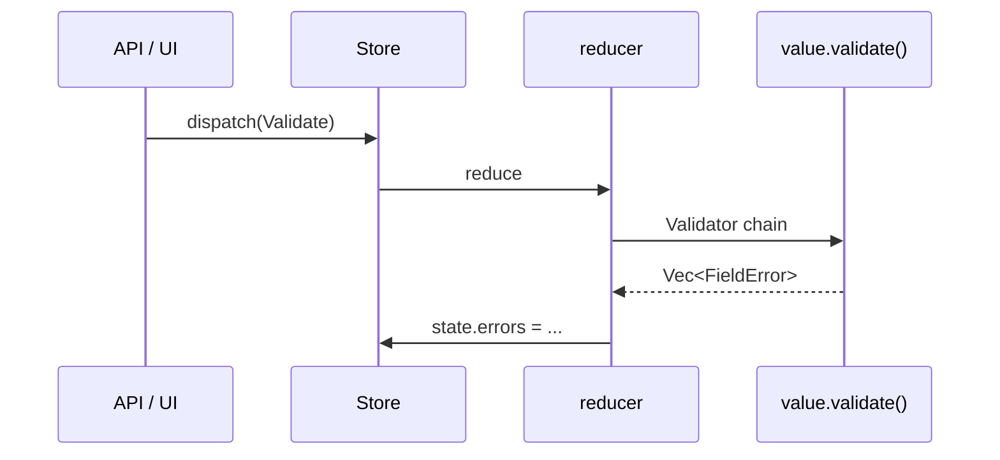

# Reusable validation framework

A small, **domain-agnostic** validation toolkit built on keypaths. It lives in
[`examples/pain/validation.rs`](../examples/pain/validation.rs) (used by the PAIN.001
example) but the core has no payment-specific logic — lift it into any project.

Three pieces:

| Type | Role |
|------|------|
| `Rule<V>` | A composable check: `Fn(&V) -> Option<Message>` |
| `Validator<R>` | Fluent accumulator over one root; prefixes every error path |
| `Validate` | Trait — `value.validate() -> Vec<FieldError>` |

```bash
cargo run -p rust-elm --example pain   # framework in action
```

See [pain.md](./pain.md) for the full ISO 20022 payload walkthrough.

---

## `FieldError`

Every failure is a path + message:

```rust
pub type Message = std::borrow::Cow<'static, str>;

pub struct FieldError {
    pub path: String,      // "PmtInf[0]/CdtTrfTxInf[1]/Amt/InstdAmt"
    pub message: Message,  // borrowed for static rules, owned for parameterized
}
```

`Message` is a `Cow` so static rules (`required()`) allocate nothing, while parameterized
rules (`max_len(35)`) can format an owned string.

---

## `Rule<V>` — composable checks

A rule returns `Some(message)` on failure, `None` when valid:

```rust
pub struct Rule<V> {
    run: Box<dyn Fn(&V) -> Option<Message>>,
}
```

Because rules are **closures, not `fn` pointers**, they can be parameterized, lifted, and
composed. Build one from a predicate:

```rust
Rule::predicate(|n: &f64| *n > 0.0, "amount must be > 0");
```

### Built-in combinators (`rules` module)

| Combinator | Type | Checks |
|------------|------|--------|
| `required()` | `Rule<String>` | non-empty |
| `max_len(n)` | `Rule<String>` | `len <= n` |
| `min_len(n)` | `Rule<String>` | `len >= n` |
| `len_in(&[..])` | `Rule<String>` | length is one of |
| `one_of(&[..])` | `Rule<String>` | value is one of |
| `iso_date()` | `Rule<String>` | `YYYY-MM-DD` |
| `iso8601_datetime()` | `Rule<String>` | ISO 8601 datetime |
| `iso_currency()` | `Rule<String>` | 3-letter ISO 4217 |
| `positive()` | `Rule<f64>` | `> 0` |
| `optional(rule)` | `Rule<Option<V>>` | lifts any rule; passes on `None` |

### `optional` — the key lifter

Wrap any rule to make it apply only when the value is present:

```rust
rules::optional(rules::max_len(140))   // Rule<Option<String>>
rules::optional(rules::len_in(&[8, 11]))
```

One combinator covers every optional field — no bespoke `optional_*` functions.

### Adding a rule

A new check works on **any** struct/keypath of that value type:

```rust
pub fn even() -> Rule<u32> {
    Rule::predicate(|n: &u32| n % 2 == 0, "must be even")
}
```

---

## `Validator<R>` — fluent accumulator

Chain checks against one root; each method returns `Self`:

```rust
Validator::new(payload)
    .field("GrpHdr/MsgId", pain_message_id(), &[rules::required(), rules::max_len(35)])
    .field("GrpHdr/CreDtTm", pain_creation_date_time(), &[rules::required(), rules::iso8601_datetime()])
    .field("GrpHdr/InitgPty/Id", pain_initiating_party_id(), &[rules::required()])
    .finish()
```

| Method | Use |
|--------|-----|
| `new(root)` / `with_prefix(root, prefix)` | start; `with_prefix` tags every path |
| `field(path, kp, rules)` | validate the value reached by a keypath (records `"missing"` if absent) |
| `value(path, &v, rules)` | validate a borrowed value directly (e.g. `Option<_>` fields) |
| `ensure(cond, path, msg)` | push an error unless `cond` holds |
| `each(path, items, f)` | validate a collection with indexed, auto-prefixed sub-validators |
| `merge(errors)` | fold in already-prefixed errors (cross-field checks, nested results) |
| `finish()` | return `Vec<FieldError>` |

### Path prefixing

`with_prefix` + `each` build nested paths automatically:

```rust
Validator::with_prefix(pmt, "PmtInf[0]")
    .field("PmtMtd", pmt_payment_method(), &[rules::required(), rules::one_of(&["TRF"])])
    .each("CdtTrfTxInf", &pmt.credit_transfer_tx_infos, validate_credit_transfer)
    .finish();
// errors → "PmtInf[0]/PmtMtd", "PmtInf[0]/CdtTrfTxInf[0]/..."
```

`each` calls a `fn(&T, &str) -> Vec<FieldError>` per item, passing the fully-prefixed path,
so item validators just use `Validator::with_prefix(item, prefix)`.

### Cross-field checks

Checks spanning multiple fields return `Option<FieldError>` and fold in via `merge`
(`Option` is an `IntoIterator`):

```rust
fn validate_control_sum(payload: &Pain001) -> Option<FieldError> { /* ... */ }

Validator::new(payload)
    .merge(validate_group_header(payload))
    .merge(validate_control_sum(payload))
    .finish();
```

---

## `Validate` trait

Give a type a one-call entry point:

```rust
pub trait Validate {
    fn validate(&self) -> Vec<FieldError>;
}

impl Validate for Pain001 {
    fn validate(&self) -> Vec<FieldError> {
        validate_pain001(self)
    }
}
```

Then from a reducer, test, or API handler:

```rust
state.errors = state.payload.validate();
state.submitted = state.errors.is_empty();
```

---

## Why keypaths

`field` takes a `KpType<'static, R, V>`, so the **same rule set** applies regardless of how
the value is reached — a top-level field, a nested path via `Kp::new(get, get_mut)`, or a
composed chain. Rules are bound to the *value type* (`Rule<String>`), not to a struct, which
is what makes them reusable across every field of that type.

---

## Use in the elm loop



Keep validation **pure** inside the reducer — no I/O. For remote payloads, load via an effect,
then dispatch `Validate`.

---

## Related files

| File | Role |
|------|------|
| [`examples/pain/validation.rs`](../examples/pain/validation.rs) | Framework + PAIN rules |
| [`examples/pain/keypaths.rs`](../examples/pain/keypaths.rs) | Reusable `KpType` paths |
| [`examples/pain/model.rs`](../examples/pain/model.rs) | Payload structs (`#[derive(Kp)]`) |
| [`examples/pain.rs`](../examples/pain.rs) | Elm store wiring |
| [pain.md](./pain.md) | ISO 20022 walkthrough |
